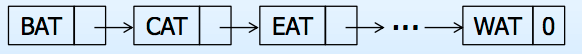
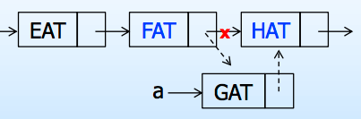
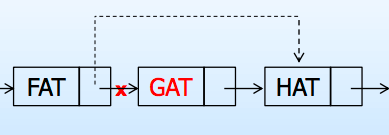

## Array and Linked List

### Array

배열이라고 불리는 Array는 자료구조에서 가장 먼저 배우는 가장 기본적인 자료구조입니다. 논리적 순서와 물리적 순서가 일치하는 자료구조로 index를 통해서 원하는 데이터에 접근 할 수 있습니다. 이를 `Random Access`가 가능하다고 하는데 원하는 데이터에 바로 접근이 가능하기 때문에  `O(1)`로 표현이 가능합니다. 

하지만 삽입과 삭제를 할 경우는 쉽지 않습니다. 예를 들어, 배열에서 index가 5인 데이터를 삭제하고 싶다고 한다면 삭제한 뒤에 index가 5인 곳이 비어있게 됩니다. 따라서 삭제한 데이터 뒤에 존재하는 모든 데이터들을 왼쪽으로 한 칸씩 이동시켜줘야 하는 번거로움이 발생합니다.  

삽입을 할 때에도 마찬가지 입니다. 만약 index가 5인 곳에 어떤 데이터를 넣고 싶다면 먼저 삽입하려는 곳부터 있는 모든 데이터를 오른쪽으로 한 칸씩 이동시켜준 뒤에 빈 공간에 원하는 데이터를 삽입해줘야 하는 번거로움이 발생합니다.

따라서 삽입과 삭제를 하는 경우 `O(n)`이 됩니다. 

### Linked List

위에서 배열은 삽입과 삭제가 쉽지 편리하지 않았다는 것을 알 수 있습니다. 그래서 좀 더 편리하게 삽입과 삭제를 하기 위해 나온 것이 Linked List입니다. Linked List는 노드로 구성되어 있습니다. 하나의 노드는 데이터와 다음 노드를 가르키는 주소 포인터를 가지고 있습니다. 그리고 배열과 다르게 동적으로 메모리를 사용하기 때문에 공간 낭비를 줄일 수 있습니다. 그러나 다음 노드 주소 포인터를 가지고 있기 때문에 메모리를 추가적으로 사용하는 단점이 있습니다. 

그렇다면 Linked List는 삽입과 삭제가 어떻게 이루어지는지 알아보자. 다음과 같은 Linked List가 있다고 가정해봅시다.

여기서 중간에 GAT라는 노드를 중간에 삽입을 하고 싶다고 한다면 어떻게 해야 할까요?

먼저 노드 하나를 할당해서 그 안에 GAT라는 값을 넣어 줍니다. 그리고 FAT의 다음 노드 주소 포인터를 GAT 노드를 가르키게 주소 포인터를 바꿔 줍니다. 마지막으로 GAT 노드의 다음 주소 포인터가 HAT을 가르키게 만들면 원하는 위치에 노드를 삽입할 수 있습니다. 

삭제의 경우도 한 번 살펴보겠습니다.

GAT를 삭제하고 싶다고 가정하겠습니다. 먼저 GAT 앞 노드인 FAT를 찾아야 합니다. 찾았다면 FAT의 다음 노드 주소 포인터를 GAT의 다음 노드인 HAT를 가르키도록 바꿔줍니다. 그리고 GAT 노드를 삭제해줍니다. (사실 삭제하지 않아도 이미 접근할 수 없습니다.)

이렇게 삽입과 삭제하는 과정에 대해 살펴봤는데 배열과 다르게 Linked List는 O(1)로 해결할 수 있습니다. 하지만 Linked List는 논리적인 순서와 물리적인 순서가 일치하지 않기 때문에 Search를 할 때 처음부터 일일이 확인하면서 찾아야한다는 단점이 있습니다. 따라서 원소를 찾기 위해 O(n)의 시간이 더해집니다. 

결과적으로 Linked List는 탐색을 하는 과정과 삽입,삭제하는 과정에서 모두 Time Complexity가 O(n)입니다. 그렇다면 왜 사용할까라는 생각이 들 수 있는데 결론부터 말하면 `Tree`, `Graph`와 같이 복잡한 자료구조를 linked list를 이용해서 구현하게 됩니다.

