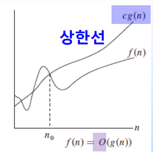
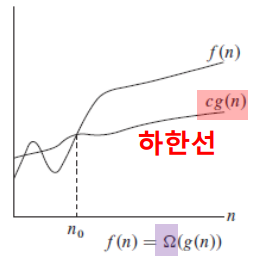
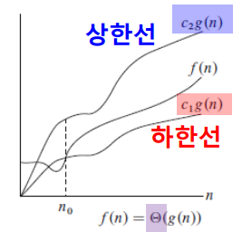

## Basic Concept

### Foundation Of Data Structure

데이터를 읽고 변경하기 위해서 자료를 저장하고 조직화하는 방법에 대해서 공부하는 것이 자료구조(Data Structure)이다. 자료구조에는 크게 2가지로 구분이 될 수 있다.

- 선형 구조

  데이터를 연속적인 공간에 저장하는 것으로 **Array, Linked List, Queue, Stack** 등이 있다.

- 비선형 구조

  데이터를 비연속적인 공간에 저장하는 것으로 **Tree, Graph ** 등이 있다.

  ​
*저는 앞으로 위에서 말한 것들을 기본적으로 정리해 나갈 것입니다.*

### Performance Evaluation

우리는 데이터를 처리할 때 단순히 프로그램이 잘 동작하는 것 뿐만 아니라 어떤 상황에서도 좋은 성능(performance)을 내기 위해 노력해야 한다. 그렇기 때문에 성능을 평가하는 것은 굉장히 중요한데 이를 평가하는 요소는 크게 두 가지가 존재한다. 얼마나 빠르게 데이터를 처리하는 가를 보여주는 시간 복잡도(Time Complexity)와 메모리를 어느 정도 사용하냐를 보여주는 공간 복잡도(Space Complexity). 특이한 점은 하드웨어와 무관하게 측정이 된다는 점이다. 

- Time Complexity

  간단히 말해서 프로그램을 완료할 때까지 소요되는 시간을 뜻한다.

- Space Complexity

  간단히 말해서 프로그램 실행을 완료하기 위해서 필요한 메모리 크기를 뜻한다.

  ​

그렇다면 어떻게 표기하고 사용하는 지에 대해 알아보자. 나타내는 방법은 Big-Oh, Omega, Theta 이렇게 3가지가 존재한다. 

- Big-Oh

  상한선(upper-bound)을 규정할 때 사용하며 O(f(n))으로 표기한다. 

  

- Omega

  하한선(lower-bound)를 규정할 때 사용하며 Ω(f(n))으로 표기한다.

  

- Theta

  상한선과 하한선을 동시에 규정할 때 사용하며 Θ(f(n))으로 표기한다.

  

3가지에 대해 알아봤지만 실제로 많이 사용되는 것은 Big-Oh이며 저 또한 배울 때를 제외하고는 항상 Big-Oh만을 사용했습니다.

Big-Oh를 쉽게 계산하기 위해서는 프로그램이 동작하는 경우에 있어 Worst-Case를 생각하면 됩니다.

