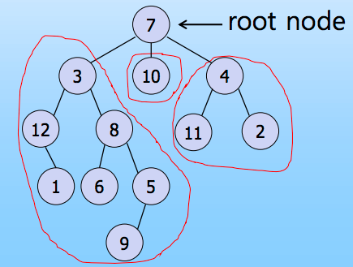
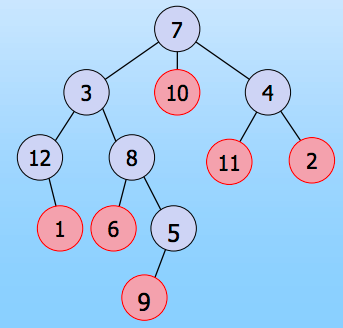

# Basic Concept Of Tree

### Intro

이번에 정리할 내용은 `Tree`이며 트리와 트리의 구성 요소 그리고 용어들에 설명하고자 합니다. 트리 구조는 많은 곳에서 사용되는 자료 구조입니다. 저는 맥북을 사용하는데 맥북의 디렉토리 구조가 바로 Tree라고 할 수 있습니다.

 

 

이렇게 뿌리를 내려가면서 아래로 접근할 수 있는데, 이런 구조를 Tree라고 할 수 있습니다. 아직 감이 안 잡히시면 다음 그림을 보시면 이해가 될 겁니다.

 

이렇게 계층적으로 디렉토리를 표현하고 이를 노드와 엣지로 표현을 하게 되면 다음 과 같은 그림이 됩니다.

 

이해가 좀 되시나요? 저런 노드와 엣지로 구성된 자료구조를 트리라고 부릅니다.

  

자료 구조에서 트리를 그리면 저런 그림으로 표현을 합니다. 그렇다면 자세하게 트리가 무엇인지 얘기해보겠습니다. 

## Tree에서 사용되는 용어

트리는 지금까지 다뤘던 자료구조와 다르게 `비선형 구조`입니다. 그림처럼 계층적인 표현이 가능하며, 원과 선으로 추상화를 시켜 놓았습니다. 사실 트리에서는 설명해야 할 용어들이 많이 있습니다. 

#### Node 

 트리를 구성하고 있는 가장 중요한 요소로 데이터를 담거나 노드 번호를 담고 있습니다. 

#### Edge

노드와 노드를 연결하는 선을 의미합니다. 

#### Root Node 

간단히 말하면 트리 구조에서 가장 위에 있는 첫번째 노드를 의미합니다. 트리 구조는 트리의 모임이라고 이해하면 좋습니다. 트리와 트리가 만나 한 트리가 되고 그 트리는 또 다른 트리와 만나 더 큰 트리가 되는… 그런 구조라고 생각하시면 좋습니다. 즉, 여러 개의 트리가 모여 하나의 트리가 되었다라고 생각하는 겁니다. 그리고 각각의 트리의 가장 첫 번째 노드가 Root Node가 됩니다. 

 

그림처럼 각각의 3개의 Subtree가 모여서 하나의 트리로 표현이 되어 있다고 볼 수 있는 겁니다. 전체를 하나로 보면 7을 담고 있는 노드가 Root node가 됩니다. 그리고 Subtree로 보게 되면 각자 Root node를 하나씩 가지고 있는게 됩니다. 

#### Degree 

각각의 노드가 가지고 있는 Subtree의 갯수입니다. 다음 그림을 보겠습니다.

  

각 노드 옆에 파란색으로 숫자가 써있는데 저 숫자가 Degree를 의미합니다. 그리고 Tree의 Degree가 뭐냐고 물어보게 되면 전체 Tree에서 가장 큰 Degree를 말하면 됩니다. 여기선 3이 가장 크므로 Tree의 Degree는 3이 됩니다.

#### Leaf Node

Degree가 0인 노드를 의미합니다. 간단하게 생각하면 트리의 말단에 존재하는 노드라고 생각할 수 있습니다.  

여기서 빨간색으로 칠해진 노드가 바로 Leaf node입니다. 

#### Internal Node

Leaf Node와 다르게 Degree가 1보다 크거나 같은 노드를 의미합니다. 위 그림에서는 빨간색이 아닌 노드가 모두 Internal node라고 말할 수 있습니다.

#### Children Node

말 그대로 자식 노드 입니다. 위에서 Degree에 대해서 말했는데 그 의미와 비슷합니다. 각각의 노드가 가지고 있는 Subtrees를 의미합니다. 

 

* Node 7의 Children :: 3, 10, 4
* Node 3의 Children :: 12, 8

이해가 되시죠? 

별개로 left child와 right child를 구분해서 사용하기도 합니다. 주로 이진 트리에서 많이 사용되는 용어인데 왼쪽 자식 노드를 left child, 오른쪽 자식 노드를 right child라고 부릅니다. 이진 트리는 다음에 다룰 예정입니다.

#### Parent Node

말 그대로 부모 노드 입니다. 어떤 노드에 대해 상위에 연결된 노드를 가르킵니다. 예를 들어, A라는 노드의 childeren이 있을 때, 이 children의 parent가 A가 되는 것입니다.

위 그림을 그대로 사용해서 설명하면 다음과 같습니다.

* Node 3, 10, 4의 Parent :: 7
* Node 12, 8의 Parent :: 3

#### Sibling Node

말 그대로 자매 노드 입니다. Parent가 같은 node들을 의미합니다.

위 그림을 그대로 사용해서 설명하면 다음과 같습니다.

- Node 3, 10, 4는 서로 Sibling 입니다.
- Node 12, 8은 서로 Sibling 입니다.

#### Ancestors 

말 그대로 조상 노드들을 의미합니다. 자기 자신부터 Root까지의 경로에 있는 모든 Node들을 의미합니다.

위 그림을 그대로 사용해서 설명하면 다음과 같습니다.

* Node 9의 Ancestors :: 5, 8, 3, 7
* Node 1의 Ancestors :: 12, 3, 7

#### Descendants

말 그대로 선조 노드들을 의미합니다. 자기 자신부터 모든 subtrees의 leaf node까지의 경로에 있는 모든 Node들을 의미합니다.

위 그림을 그대로 사용해서 설명하면 다음과 같습니다.

* Node 3의 Descendants :: 12, 1, 8, 6, 5, 9
* Node 4의 Descendants :: 11, 2

#### Depth

말 그대로 깊이를 의미 합니다. 다음 그림을 보면 이해가 쉽게 될 것 같습니다.

 

이렇게 노드들을 계층으로 표현한게 depth입니다. Root Node의 depth를 0으로 하는 경우도 있고 1로 하는 경우도 있지만 여기서는 0으로 정의하겠습니다. 또한 depth가 아닌 Level이라고 표현하는 경우도 있습니다.

#### Height

말 그대로 높이를 의미합니다. 특정 Node로부터 leaf node까지의 경로에서 edge가 제일 많은 경로의 edge의 갯수를 의미합니다. 쉽게 표현하면 Descendants 중에서 가장 깊은 depth에 있는 leaf node까지의 선의 개수라고 생각하면 편합니다.

 

여기서 Node 8의 height는 2 입니다. 아래로 내려가는데 가장 depth가 깊은 노드는 9입니다. 따라서 9까지의 선의 개수인 2가 height가 됩니다. 

전체 트리의 height는 4가 됩니다. 즉, depth가 height가 됩니다. 

#### 지금까지 Tree의 기본적인 구성 요소와 용어들에 살펴보았습니다. 다음에 정리할 내용에서 본격적으로 트리에 대해 다룰 예정입니다. 

