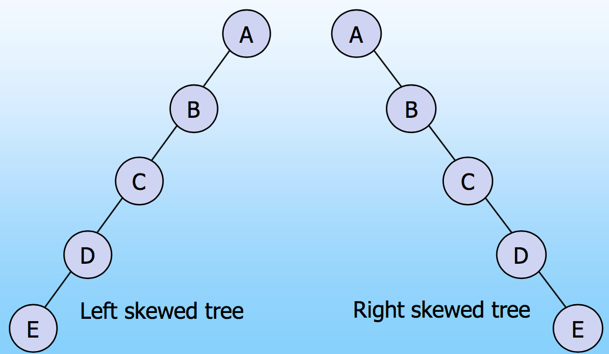
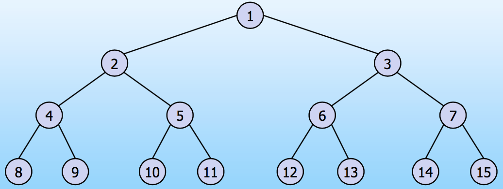
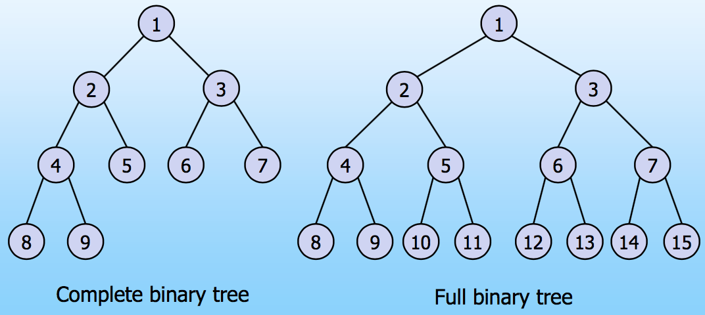
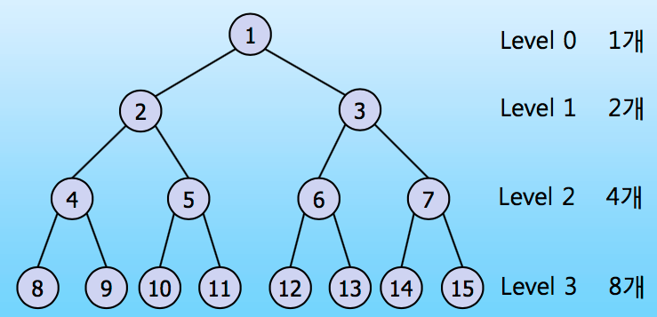
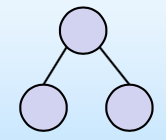
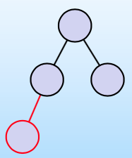
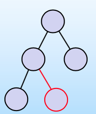
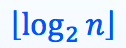
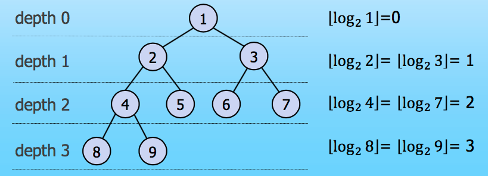

#  Binary Tree

저번에 이어서 이번에 정리할 주제는 `Binary Tree`(이진 트리) 입니다. 저의 경우 트리를 공부하면서 다른 형태의 트리는 다루지 않고 다양한 이진 트리에 대해서 계속 공부했습니다. 그럼 지금부터 Binary Tree에 대해 알아보겠습니다.

### Binary Tree

이진 트리는 모든 노드의 degree가 2개 이하인 경우를 말합니다. 다른 말로 children이 2개 이하인 경우 입니다. 그래서 3가지 경우가 존재 할 수 있습니다. 

 

위 그림 처럼 degree가 0, 1, 2인 경우입니다. 저런 경우를 모두 이진 트리라고 부를 수 있습니다. 계속 공부를 하다보면 degree가 2인 경우만 이진 트리로 생각하게 되는 경우가 생기는데 아니라는 점을 명심해야 합니다.  *//제가 멍청해서 그런 걸수도…* 

이러한 이진 트리는 재귀적으로 정의가 가능합니다. 노드 개수가 유한인 집합에서 노드는 0개 또는 1개의 Root Node와 분리되어 있는 두 개의 Binary Tree로 구성이 된다라고 정의 할 수 있습니다.

Binary Tree를 배우게 되면 다음 3가지 종류의 이진 트리에 대해 배우게 됩니다.

* Skewed Binary Tree (편향 이진 트리)
* Full Binary Tree (포화 이진 트리)
* Complete Binary Tree (완전 이진 트리)

### Skewed Binary Tree

Skewed Binary Tree는 편향 이진 트리라고 불립니다. 모양을 보면 이해가 빠르기 때문에 그림을 먼저 보겠습니다.

 

위 그림처럼 한 쪽 방향으로만 Child가 있는 트리를 편향 이진 트리라고 부릅니다. 편향 이진 트리는 주로 반례(?)와 같은 예시에서 많이 사용됩니다. 즉, 어떤 상황에서 편향 이진 트리에서는 어떤지를 따져봐야 할 경우가 존재합니다. 

### Full Binary Tree

Full Binary Tree는 포화 이진 트리라고 불립니다. Depth가 가장 큰 노드를 제외하고 각 depth에 모든 원소들은 left child와 right child를 모두 가지고 있어야 합니다.

 

쉽게 설명하면 leaf node를 제외한 모든 노드는 left/right child를 가지고 있어야 모든 leaf node는 depth가 똑같아야 합니다. 그래서 위 그림과 같은 형태가 나타납니다.

### Complete Binary Tree

Complete Binary Tree는 완전 이진 트리라고 불립니다. 높이가 h이고 노드 수가 n인 이진 트리에서 노드의 레벨 순서 번호들의 각 위치가 포화 이진 트리 번호 1에서 n까지 모두 일치하는 트리 입니다. 포화 이진 트리와 완전 이진 트리를 비교해서 보면 이해가 될 것 입니다.

 

완전 이진 트리는 포화 이진 트리와 다르게 비어 있는 공간이 있는 것처럼 보입니다. 마지막 depth의 공간이 채워질 수도 있고 안 채워 질수도 있다는게 포화 이진 트리와 다른 점이라고 할 수 있습니다. 

## Binary Tree의 특성

지금부터 알아볼 것은 Binary Tree의 특성에 대한 것입니다. 3가지에 대해 알아보려고 합니다.

* 노드의 최대 개수
* leaf node의 개수와 degree가 2인 node의 개수의 관계
* Complete Binary Tree의 height

위의 3가지에 대해서 증명하고 알아보려고 합니다.

### 노드의 최대 개수

여기서는 두 가지에 대해 가정을 하고 그 가정에 대한 증명을 다룰 예정입니다.

* Level i에 있는 노드의 최대 개수는 **2^i**이다.
* Depth가 k인 트리에 있는 노드의 최대 개수는 **2^(k+1) - 1**이다.

##### 첫 번째 문제는 Induction을 이용해 증명하고자 합니다.

##### *Basis Step*

Level 0 일 때, 1개의 노드가 존재하는데 2^0 = 1이 되므로 참이다.

##### *Inductive Step*

i를 0보다 큰 임의의 정수이며 level i-1에서의 노드의 최대 개수를 2^(i-1)개라고 가정하겠습니다.

Binary Tree이므로 각각의 노드는 최대 Degree가 2이다. 따라서 level i에서의 최대 노드는 **2^(i-1) x 2**개 즉, 2^i이 된다.

##### 두 번째 문제를 증명해보겠습니다.

최대 개수는 level i에서의 최대 노드 개수를 0부터 k까지 더해 나가면 됩니다. 시그마로 표현이 가능하지만…마크다운으로 표현할  방법이 없어서 말로 하겠습니다.

1 + 2 + 4 + 8 + … + 2^k = 2^(k+1) - 1이 됩니다. depth별로 모두 더해 나가면 그게 노드의 최대 개수가 되기 때문입니다. 

 

위 사진을 보면 이해가 쉽게 될것이라 생각이 됩니다.

### leaf node의 개수와 degree가 2인 node의 개수의 관계

비어있지 않은 Binary Tree에서 Leaf node의 개수가 j개이고 degree가 2인 노드의 개수가 k개라고 한다면 j = k + 1 입니다. 즉, degree가 2인 노드 개수에 1을 더하면 leaf node의 개수가 나오게 됩니다. 

이번 문제도 Induction을 이용해 증명하도록 하겠습니다. 

##### *Basis Step*

Root node만 있을 경우 degree가 2인 node의 개수는 0개이며, leaf node는 1개이므로 성립합니다.

##### *Inductive Step*

1보다 큰 임의의 정수 n이 있고, 노드 개수가 n-1개 일 때, leaf node의 개수가 degree가 2인 node의 개수보다 1 크다고 가정하겠습니다.

 

만약 위와 같은 트리가 있고 left child에 node를 추가할 때 어떤 일이 발생하는 지 알아보겠습니다.

#### case 1)

 

left child에 node를 하나 추가할 경우 leaf node의 개수는 변하지 않습니다. 하나는 줄었지만 다시 하나가 늘어났기 때문입니다. degree가 2인 node의 개수 또한 변함이 없습니다. 

#### case 2)

 

right child를 하나 추가하게 되면 leaf node의 개수는 1개가 증가하게 됩니다. 또한 Degree가 2인 node의 개수도 1개 증가하게 됩니다. 

자세하게 증명을 해보면 다음과 같습니다.

가정에 의해 node의 개수가 n-1개일 경우 leaf node의 개수는 degree가 2인 node의 개수보다 1개 더 많습니다. 그런데 여기서 node를 하나 추가하면 어떻게 될지 알아봐야 하는데 가능한 경우가 위의 2가지 경우입니다.  

parent node의 degree가 0인 경우, node를 하나 추가하면 추가된 node가 leaf node가 되고 parent node는 leaf node가 아닌 degree가 1인 node가 됩니다. 즉,  leaf node가 +1, -1이 되어 결과적으로 0이 됩니다. 따라서 leaf node와 degree가 2인 node의 개수에 영향을 끼치지 않으므로 만족이 가능합니다.

parent node의 degree가 1인 경우, node를 하나 추가하면 추가된 node는 leaf node가 되고 parent node는 degree가 2인 node가 되어 leaf node와 degree가 2인 node의 개수가 동일하게 1개씩 증가하게 됩니다. 

따라서 **leaf node의 개수 = degree가 2인 node의 개수 + 1**이 됩니다.

### Complete Binary Tree의 height

완전 이진 트리에서 height를 구하는 방법이 있습니다. 

log를 사용해서 계산을 하는데 markdown에서 log를 어떻게 표현해야 할지 몰라 그림과 글로 대체해서 설명을 하겠습니다.

 

결론적으로 말하면 위 식이 바로 Complete Binary Tree의 height를 구하는 공식이라고 할 수 있습니다. 여기서 n은 노드의 개수를 의미합니다. 그리고 아래만 안쪽으로 휘어있는 괄호는 괄호 안의 수보다 작거나 같은 수 중 가장 큰 정수를 의미하며 쉽게 말해서 소수점 이하를 버리는 연산을 해주는 기호라고 할 수 있습니다. 아래 그림을 보면 더 이해가 되실 겁니다.

 

책에 따라 root node의 height를 1로 정의하는 경우가 있는데 그 경우 괄호 안에 +1을 해주면 됩니다. 

#### *지금까지 Binary Tree에 대해 알아봤습니다. 하지만 아직 Tree에 대해 반도 알지 못하는 수준입니다. 앞으로 세번 정도 더 정리해야 Tree에 대해서 잘 알게 될 것 같습니다. 앞으로 Tree에서 사용되는 알고리즘과 Binary Search Tree, Red Black Tree, Binary Heap에 대해 정리를 할 예정입니다.*

