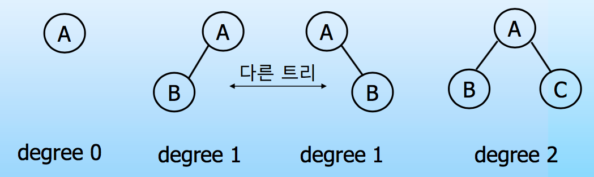

#  Binary Tree

저번에 이어서 이번에 정리할 주제는 `Binary Tree`(이진 트리) 입니다. 저의 경우 트리를 공부하면서 다른 형태의 트리는 다루지 않고 다양한 이진 트리에 대해서 계속 공부했습니다. 

### Binary Tree

이진 트리는 모든 노드의 degree가 2개 이하인 경우를 말합니다. 다른 말로 children이 2개 이하인 경우 입니다. 그렇다면 3가지 경우가 존재 할 수 있습니다. 

 

위 그림 처럼 degree가 0, 1, 2인 경우입니다. 저런 경우를 모두 이진 트리라고 부를 수 있습니다. 계속 공부를 하다보면 degree가 2인 경우만 이진 트리로 생각하게 되는 경우가 생기는데 아니라는 점을 명심해야 합니다.  *//저만 그런 걸 수도…* 

이러한 이진 트리는 재귀적으로 정의가 가능합니다. 노드 개수가 유한인 집합에서 노드는 0개 또는 1개의 Root Node와 분리되어 있는 두 개의 Binary Tree로 구성이 된다라고 정의 할 수 있습니다.

 

Binary Tree를 배우게 되면 다음 3가지 종류의 이진 트리에 대해 배우게 됩니다.

* Skewed Binary Tree (편향 이진 트리)
* Full Binary Tree (포화 이진 트리)
* Complete Binary Tree (완전 이진 트리)

### Skewed Binary Tree

### Full Binary Tree

### Complete Binary Tree

