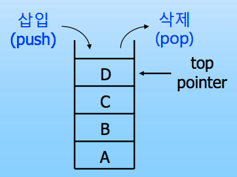
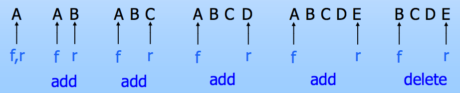

## Stack and Queue

### Stack

스택은 선형 자료구조의 한 종류로 삽입과 삭제가 한 쪽 방향에서 이루어지는 구조입니다. 

그림을 보면 알 수 있듯이 삽입과 삭제가 한 쪽 끝에서만 이루어지고 있습니다. 그렇기 때문에 데이터를 넣게 되면 아래부터 차곡 차곡 쌓이게 되는데 삭제를 할 때도 넣었던 쪽에서 빼야하기 때문에 가장 마지막에 넣은 데이터가 가장 먼저 삭제되는 Last In First Out이며 이를  `LIFO` 라고 줄여서 부릅니다.

스택에서는 Overflow와 UnderFlow라는 것이 존재합니다.

* Overflow
  * 데이터를 저장할 때, 저장할 수 있는 공간의 크기가 꽉 차서 더 이상 데이터를 넣을 수 없는 상태를 말합니다.
* Underflow 
  * 데이터를 삭제할 때, 더 이상 삭제할 원소가 남아 있지 않는 상태를 말합니다.

사실 Underflow는 별 문제가 안 되지만 Overflow는 문제가 될 수 있습니다. 그렇다면 Overflow가 나지 않도록 하려면 어떻게 해야 할까요?

가장 처음 생각할 수 있는 건 MAX_STACK_SIZE를 **'잘'** 정하는 것입니다. 

* MAX_STACK_SIZE를 생각보다 작게하면 불필요한 메모리 낭비가 없어서 좋지만 Overflow가 발생할 확률이 높습니다.
* MAX_STACK_SIZE를 생각보다 크게하면 Overflow 발생할 확률은 낮지만 불필요한 메모리 낭비가 큽니다.

따라서 이 방법은 Overflow가 발생하는 것을 해결하는 근본적인 해결책이 아닙니다. 

다음에 생각해볼 방법은 동적으로 크기를 변경해주는 것입니다. Overflow가 발생할 때마다 Stack의 크기를 2배로 확장해주는 것입니다. 이렇게 되면 Overflow 걱정없이 데이터를 넣어주어도 상관이 없게 됩니다. 

그럼 과연 2배 확장하는 시간 복잡도는 얼마가 될까요? O(2^n)라고 생각할 수도 있지만 정답은 O(n)입니다.

처음에 크기를 1로 잡았다고 가정하고 K번 확장하게 되면 Stack의 크기는 2^k가 됩니다. 모든 과정에 대해서 doubling하는데 소요되는 시간은 1 + 2 + 4 + … + 2^k 인데 이를 계산하면 O(2^(k+1)) = O(n)이 된다.

사실 이렇게 크기를 동적으로 늘리는 방법은 Stack 외에 다른 부분에서도 널리 사용되고 있다.

### Queue

큐는 선형 자료구조의 한 종류로 삽입과 삭제가 다른 쪽 방향에서 이루어지는 구조입니다. 

그림을 보면 알 수 있듯이 삽입과 삭제가 다른 방향에서 이루어지고 있습니다. 가장 먼저 들어간 것이 front에 위치하고 그 다음부터 계속해서 오른쪽으로 순서대로 들어갑니다. 그렇게 되면 마지막에 들어간 것이 rear가 됩니다. 즉, 가장 먼저 들어간 데이터는 front에 위치하게 되고 들어오는 순서대로 rear(사진상으로 오른쪽)로 채워지게 됩니다. 
스택과 다르게 큐는 가장 먼저 들어온 데이터가 가장 먼저 삭제되는 First In First Out이며 이를 `FIFO`라고 줄여서 부릅니다.

영화관에서 표를 구매할 때 먼저 줄을 선 사람부터 먼저 표를 구매하고 나가는 상황을 생각하면 이해가 쉽습니다.

