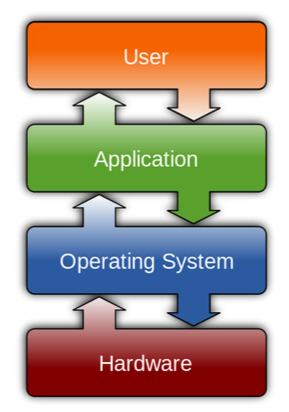

## Foundation Of OS

### Basic Concept

운영체제가 무엇일까? 컴퓨터 하드웨어와 사용자 및 각종 소프트웨어를 연결시켜주는 것을 운영체제라고 부른다. 

* 좁은 의미에서 운영체제는 커널을 뜻합니다.
* 넓은 의미로는 주변 시스템을 다루는 유틸리티와 커널을 뜻합니다.

커널은 간단히 말하면 운영체제의 핵심 부분이며 컴퓨터가 켜지고 부팅이 되면 메모리에 항상 상주하는 부분입니다. 나중에 더 자세히 이야기 할 기회가 있을 겁니다. 

*컴퓨터 공학 전공자의 입장에서는 보통 커널만을 운영체제라고 부른다고 합니다 :)*

일반적으로 운영체제가 무엇이냐고 물어보면 운영체제는 일종의 소프트웨어로 사용자나 응용 프로그램이 컴퓨터 하드웨어를 효율적이고 편리하게 사용할 수 있도록 해주는 것이라고 대답할 수 있습니다. 그러면 어떻게 효율적이고 편리하게 사용하는 걸까요?

운영체제는 컴퓨터 시스템을 `추상화`해서 프로그램과 사용자에게 제공합니다. 여기서 추상화는 실제로 CPU, 메모리, 저장장치 등이 컴퓨터 하드웨어로 존재하지만 사용자 또는 프로그램은 그것에 직접 접근하지 않고 Process, 가상 메모리, 파일이라는 추상화 된 개념을 만들어 제공해줍니다. 그러면 사용자와 프로그램은 추상화된 개념에 접근을 하고 운영체제가 이를 관리해 주는 것입니다.   `운영체제는 CPU → Process / 메모리 → 가상 메모리 / 저장장치 → 파일 등으로 추상화 시켜줍니다.`

그러면 운영체제는 구체적으로 어떤 작업들을 하고 있을까요?

운영체제는 크게 두 가지 작업을 하고 있습니다.

* `자원할당자`로서 한정된 하드웨어 자원을 관리하고 효율적이고 공정하게 자원을 분배해서 추상화 합니다. 하드웨어 자원은 한정되어 있기 때문에 프로그램들이 자원을 나눠서 사용해야 합니다.
* 프로그램들이 자원을 나눠서 사용하고 난 뒤에 가비지와 같은 것들이 남아서 이런 것들이 충돌을 일으킬 수 있는데 `제어프로그램`으로서 이를 방지해줘야 합니다.

다음에는 운영체제의 핵심 기능과 역할을 **자세하게** 다뤄보겠습니다.