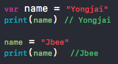
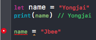
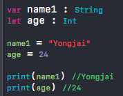
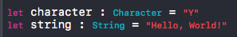

## What is Swift?

시작에 앞서서 Swift가 어떤 언어인지 가볍게 짚고 넘어갈까 합니다. 알다시피 swift는 Apple에서 iOS, macOS, watchOS, tvOS 등을 개발하기 위해 만들어진 언어입니다. 원래는 Objective - C라는 언어가 있었지만 Safe, Fast, Powerful 이라는 슬로건을 내세워 2014년에 공식적으로 발표된 아주 따끈 따끈한 언어라고 할 수 있습니다. 계속해서 새롭게 바뀌어 나가고 있는 중이고 오픈 소스로 공개되어 전 세계의 프로그래머들과 함께 성장하고 있는 언어입니다. 

*// 정말 간단히 하고 넘어가겠습니다.*

## Camel Case

프로그래밍을 하다보면 클래스, 변수 등의 네이밍을 할 때 대문자로 써야할지 소문자로 써야할지 고민을 할 때가 있습니다.

일반적으로 가장 많이 사용하는 방법은 Camel Case입니다. Swift에서도 이를 general하게 사용하며 lower Camel Case와 Upper Camel Case가 존재합니다.

* #### Lower Camel Case

  **변수, 상수, 함수, 프로퍼티** 등을 사용할 때 많이 사용합니다.  만약 student name을 선언해주고 싶다면 다음과 같이 선언해 줄 수 있습니다. 

  **let studentName = "Yongjai"**

  즉, 첫 번째 단어를 제외한 모든 단어의 첫 글자를 대문자로 작성해주는 것입니다.

  ​

* #### Upper Camel  Case

  **클래스, 프로토콜** 등을 사용할 때 많이 사용합니다. 만약 student data model이라는 클래스를 만들고 싶다면 다음과 같이 만들어 주면 됩니다.

  **StudentDataModel** 

  즉, 모든 단어의 첫 글자를 대문자로 작성해주는 것입니다.

## 변수 vs 상수

프로그래밍을 하다보면 데이터를 저장하기 위해 변수와 상수를 사용합니다. 

* 변수 

  변하는 수를 의미한다. 값을 선언한 뒤 그 값을 다시 바꿀 수 있습니다. Swift에서는 변수를 선언할 때 `var`를 이용해 선언합니다. 

   

  변수로 선언을 해줬기 때문에 값을 바꿔도 바꾼 값으로 잘 저장되는 것을 알 수 있습니다.

* 상수

  항상 같은 수를 의미한다. 값을 선언하면 다시 그 값을 바꿀 수 없습니다. Swift에서는 변수를 선언할 때 `let`을 이용해 선언합니다. 

    

  보시다시피 let으로 선언을 해주고 다시 그 값을 바꿔주면 위 사진과 같이 에러가 발생합니다.

물론 위에서 설명한 것처럼 선언과 동시에 값을 지정해 줄 수도 있지만 선언을 해준 뒤 나중에 사용할 수도 있습니다.

  

선언을 할 때, 어떤 데이터 타입인지를 같이 작성해주면 당장 값을 알려주지 않아도 나중에 불러서 사용해줄 수 있습니다.

## Data Type

이번에는 데이터 타입에 대해서 알아보려고 합니다. swift에서 사용하는 데이터 타입은 다른 언어와 별반 차이가 없습니다.

Int, Double, Float, Bool, Character, String

* **Int** 

  정수형 타입으로 **+**와 **-** 값을 포함하고 있습니다.

  *추가적으로 `unit` 이라는 타입도 있는데 이것은 **-** 값을 포함하지 않는 정수를 의미합니다.*

  ​

* **Float & Double**

  실수형 타입으로 부동소수점 방식을 사용합니다. `Float`는 32비트로 표현되고, `Double`은 64비트로 표현이 됩니다. 따라서 어떤 값을 사용하는데 크기가 어느 정도 되는지 모를 경우 Double을 사용하는 것이 바람직하며, 연산을 할 때에도 정확도면에서도 Double이 좋기 때문에 왠만하면 Double을 사용하는게 좋다고 생각합니다.

  ​

* **Bool**

  True와 False를 값으로 가지는 boolean 타입입니다. 

  ​

* **Character & String**

  `Character`는 하나의 문자*(단어가 아닙니다)*를 뜻하고, `String`은 문자열을 뜻합니다. 

   

  사진에서 보이듯이 character는 Y라는 하나의 문자만을 저장했고, string은 Hello, World!라는 문자열을 저장했습니다.

  ​

## ETC 

* swift에서는 `;` (세미콜론)을 사용하지 않아도 됩니다 :)
* 주석 처리 방법은 다른 언어와 동일하게 `//` 과 `/* */`를 사용합니다.
* 변수를 사용하기 보단 상수 사용을 지향하는데 상수로 값을 선언하게 되면 다른 사람이 코드를 읽을 때, 값의 변화에 대해 신경 쓸 필요가 없습니다. 즉, 가독성 면에서 상수를 사용하는 것이 좋습니다. 이 외에도 값에 의미를 부여해야 할 때 상수로 선언하면 직관적으로 편합니다. 