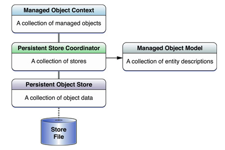

# CoreData vs Realm

iOS에서 데이터를 저장하고 추출하는 여러 가지 방법이 존재합니다. 일반적으로 Data Base를 이용해서 사용할 수 있지만, 사실 DB를 사용하려면 따로 배워서 query를 사용해야 한다는 점이 부담스러울 수 있습니다. 게다가 대부분의 관계형 DB(mysql 같은)는 독립적인 외부 프로세스를 가지고 어플리케이션과 상호작용을 하고 있습니다. 물론 SQLite와 같이 내부에 저장되는 DB도 있습니다만 sqlite는 사용해본 적이 없기 때문에 나중에 기회가 된다면 정리하겠습니다. 이렇게 DB를 사용할 수 있지만 Apple에서는 `Core Data Framework`를 만들어 제공해주었습니다. 이를 통해 DB를 잘 몰라도 데이터를 객체처럼 다루고 사용할 수 있습니다. 이와 별개로 SQLite와 CoreData를 대체할 수 있는 Realm에 대해서도 알아보고자 합니다.

## Core Data

코어 데이터에 자세한 내용을 다루기 전에 사실 코어 데이터는 DB를 목적으로 만들어진 것이 아니지만 개발자들이 DB처럼 사용하는 것에 초점을 맞춰 사용하다보니 그 용도가 한정 되어버린 케이스라고 합니다. 코어 데이터는 Object들의 관계를 나타낸 그래프들을 ER 다이어그램 같은 데이터 모델로 처리해서 영구저장소에 저장하고 빼올 수 있게 해주었는데 사실 이러한 기능들로 데이터를 저장하고 빼오는 것은 Heavy한 측면이 없지 않아 있습니다.   

다시 돌아와서, 코어 데이터는 저장소 역할을 하는 프레임워크 객체로 이루어져 있습니다. 사실 CoreData는 SQLite를 래핑하는 프레임워크 입니다. 그리고 CoreData Model을 이해하기 위해  `Core Data Stack`에 대해 알아보도록 하겠습니다. 

위 그림이 core data stack을 나타낸 그림입니다. 그림에는 없지만 어플리케이션은 가장 위에 존재하며 Managed Object Context 안에 있는 객체들과 통신을 하게 됩니다. 그리고 나머지는 coredata의 많은 기능들을 제공해주지만 어플리케이션고 직접 통신을 하지 않습니다. 그럼 하나씩 자세하게 알아보겠습니다.

### Managed Object Context

Core Data를 사용하게 되면 어플리케이션은 저장소와 직접 통신하지 않고 `Managed Object Context` 안에 있는 `Managed Object`와 통신을 하게 됩니다. 여기서 Managed Object Context는 객체를 관리하게 됩니다. Managed Object는 어플리케이션에서 데이터를 저장하기 위해 만들어 놓은 객체입니다. DB와 비교했을 때, 테이블의 row 또는 column이라고 할 수 있습니다. 새로운 raw가 추가 될때마다 이를 저장하기 위해 managed object를 생성해줘야 합니다. 

### Persistent Store Coordinator

`Persistent Store Coordinator`는 영구 객체 저장소들의 접근을 관리합니다. 하지만 우리는 이 부분에 대해 건드릴 일이 없기 때문에 신경 쓸 필요가 없습니다. 그저 상위 계층에서 여러 개의 저장소를 보여달라고 요구하게 되면 coordinator는 여러 개의 저장소를 하나의 저장소처럼 보이도록 해주는 역할을 한다는 것만 알면 될 것 같습니다.

### Persistent Object Store

`Persistent Object Store`는 데이터가 저장되는 저장소를 의미합니다. 코어 데이터에서 영구 저장소의 종류는 크게 두 가지로 나눌 수 있다. 디스크 기반 영구 저장소와 메모리 기반 영구 저장소이다. 디스크 기반 영구 저장소는 SQLite, XML 그리고 Binary를 지원합니다. 그리고 기본적으로 iOS의 SDK는 SQLite를 영구 저장소로 사용합니다. 또한 어플리케이션이 데이터를 관리하는 API는 어떤 저장소를 선택하더라도 동일하기 때문에 선택에 있어 차이는 없습니다.

### 어떻게 사용할까?

coming soon

## Realm

`Realm`은 모바일 데이터베이스를 오픈 소스로 제공해 줍니다. realm을 이용해 SQLite와 CoreData를 대체할 수 있습니다. CoreData가 SQLite 기반이었다면 Realm은 C++로 고유한 특성을 가지고 있습니다. 

### 왜 사용하는가?

* Realm은 모바일 환경을 위해 만들어졌기 때문에 데이터를 저장하고 가져오는데 빠르고 효율적입니다.

  *// SQLite와 비교해도 월등히 빠른 속도를 보여줍니다.* 

* Realm은 다양한 기능을 지원하는데, 대표적으로 migration, graph query 등이 있습니다. (써본적은 없습니다ㅎㅎ)

* 객체를 상속해서 손 쉬운 사용을 제공합니다.

* 사이트가 한글화가 잘 되어 영어를 모르더라도 찾아서 잘 사용할 수 있습니다. 

  *// https://realm.io/kr/ 에서 확인하세요 :)*

### 어떻게 사용할까?

크게 두 가지 방법이 있습니다. `CocoaPods`를 사용하거나 `Static Framwork`로 하는 방식입니다. 저는 CocoaPods만 사용해봤습니다. 

* CocoaPods :: Podfile을 생성해서 Realm을 타겟에 추가해주면 됩니다. 
* Static Framwork :: Realm 파일을 직접 다운로드해서 직접 추가해주면 됩니다.

https://github.com/Yongjai/iOS_Basic/tree/master/FinalTest/FinalTest에서 간단하게 Realm을 사용한 코드가 있으니 확인하실 수 있습니다.

