## Effective Objective-C

### Intro
앞으로 7번에 걸쳐 Effective Objective-C라는 책을 보며 공부한 내용과 NHN NEXT iOS_Adv 수업 중에 배운 내용을 함께 정리하고자 합니다. 이 글은 공부를 목적으로 작성되는 글입니다.  

### item#1. Objective-C의 기원과 친숙해져라

objective-c에는 런타임이라는 것이 숨겨져 있다. 사실 objective-c는 스몰토크라는 언어가 가지고 있는 컨셉과 구조와 문법을 반영해서 만든 언어입니다. 그래서 스몰토크에서 넘어온 문법 중에 objective-c에서 가장 많이 사용하는 것이 `대괄호`이다. 특정한 객체에게 메세징을 보낼 때 사용합니다. 다음 짧은 코드를 보겠습니다.

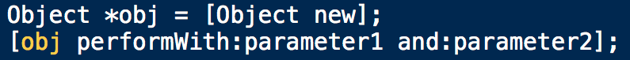

첫 줄은 obj라는 객체를 만들면서 클래스한테 메세지를 보내게 됩니다. 

*//여기서 new는 old-fasion한 문법인데 컴파일러가 이 코드를 실행시키면 +alloc 과 -init을 불러줍니다. 초기에는 스몰토크에서 넘어와서 사용했지만 지금은 사용되지 않는다. 지금도 사용할 수는 있다고 하는데 권장되지는 않는다고 합니다.*

두번째 줄은 obj라는 객체에 performWith 함수를 통해 파라미터를 메세징하는 방식입니다. 

다음 그림을 보겠습니다.

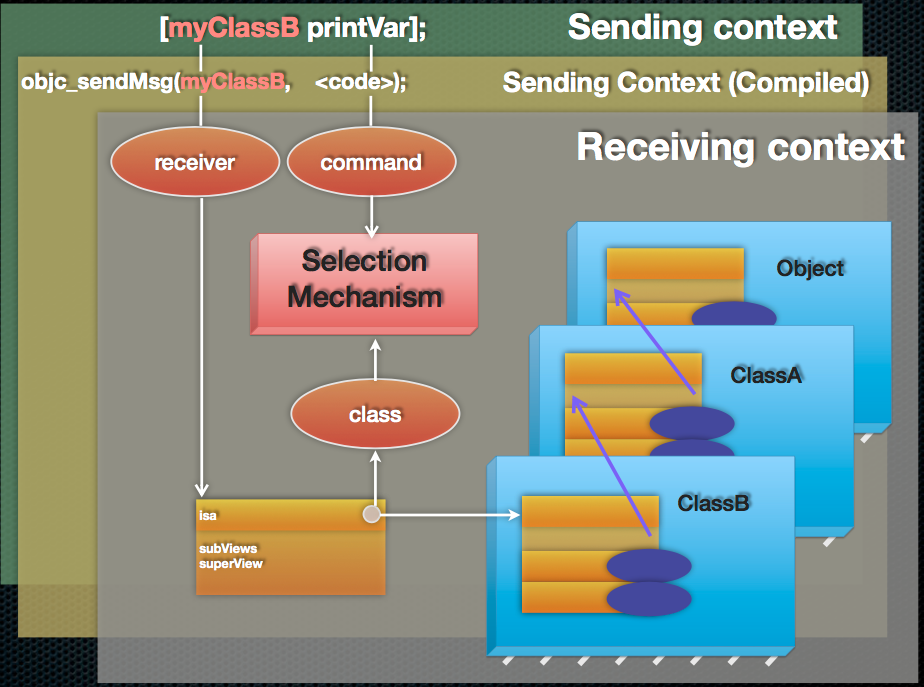

여기서 `isa`라는 게 있습니다. 처음 보고 아이사, 이사라고 읽었는데 이즈어라고 읽는 거라는걸 알게되고 무지함에 감탄했습니다. objective-c의 모든 객체는 isa라는 변수를 가지고 있습니다. isa는 클래스인데 클래스를 가르키는 포인터를 가지고 있습니다. 

**I'm am a boy**라는 문장을 살펴보겠습니다.  I와 boy의 관계를 생각하면 I는 boy의 범주 안에 포함되어 있고 이를 is a 관계라고 합니다. 

[myClassB printVar]를 보면 myClassB와 printVar도 isa 관계입니다. 메세지는 myClassB라는 인스턴스로 전달됩니다. 그러면 런타임이 obj_sendMsg라는 함수 호출을 하게 되고 런타임 함수가 myClassB의 isa 포인터를 보고 myClassB라는 인스턴스가 어떤 클래스인지를 알게 됩니다. 그러면 런타임은 찾은 클래스가 가지고 있는 메소드를 가지고 printVar라는 selector가 어디에 있는 메소드인지 찾아줍니다. 

*//이게 맞는건지 잘 모르겠습니다*ㅜㅜ

Objective-c에서 객체는 `항상` 힙에 할당이 됩니다.  다음 코드를 통해 좀 더 알아보겠습니다.

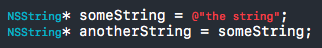

첫 번째 코드부터 살펴보겠습니다. 여기서 인스턴스는 the string이고 someString이라는 포인터가 생기는데 이 포인터는 the string을 가르키게 됩니다. 

두 번째 코드 역시 마찬가지 입니다. anotherString이라는 포인터는 someString의 포인터를 복사하고 the string을 가르키게 됩니다.

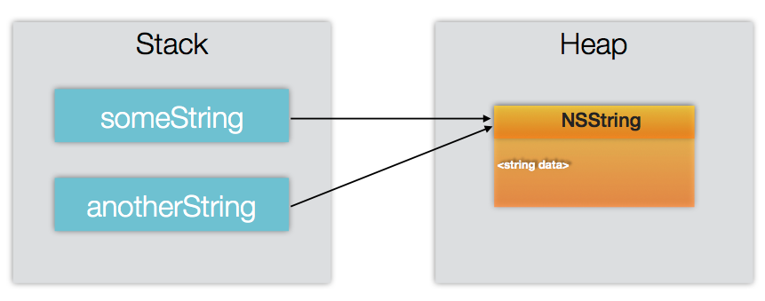

위에서 말했듯이 객체는 힙에 할당이 되어 있고 스택에는 객체를 가르키는 포인터 주소를 담고 있습니다. 

다음 코드를 보겠습니다.

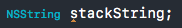

만약 이런 식으로 선언을 하게 되면 어떻게 될까요? 에러가 나는데 이유는 간단합니다. 모든 객체는 무조건 힙에 만들어져야 하기 때문에 포인터로 선언을 해줘야 합니다.

하지만 예외인 경우가 있습니다. `int`, `double`,`bool`, `CGRect`, `struct` 등등… 이런 것들은 클래스가 아니라 C 타입이고 이러한 타입은 스택에 값을 바로 저장할 수 있기 때문입니다. `NSUInteager` 또한 내부는 int랑 같아서 스택에 바로 값을 저장한다. 이런 것들은 스택 공간 변수라고 불립니다. 

#### Bonus!!!  

Objective-C에서는 시점을 다루는 용어가 있고, 뒤에 time을 붙여서 사용합니다. 간단히 설명하면 다음과 같습니다.

* **Design time** : 화면 혹은 코드를 작업할 때
* **Compile time** : 컴파일 해서 빌드가 다 될 때까지
* **Run time** : 빌드가 되고나서 실행 할 때

우리는 Design time에 코드로 인스턴스를 선언하더라도 실제로 인스턴스는 생기지 않고 메모리와 힙이 할당되지 않는다는 것을 알고 있습니다. 이를 파악하기 위해 process의 memory 구조에 대해 알고 넘어가겠습니다.

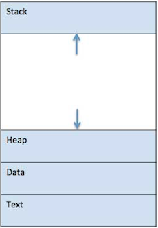

마땅한 자료가 없어 구글에 검색해보니 좋은 그림이 있어서 가지고 왔습니다. 각 영역별로 간단하게 설명을 하면 다음과 같습니다.

* **Text** : 컴파일 시점에 만들어진 바이너리 코드가 이 곳에 적재됩니다.

* **Data** : global 변수가 들어가는데 컴파일 시점에 이미 할당을 해놓습니다. 이 영역은 `0으로 채워진 영역`과 `0으로 채워지지 않은 영역` 두 가지로 나누어져 있습니다. 

  * **0으로 채워진 영역** : 0으로 값이 초기화 되어 있는 변수들
  * **0으로 채워지지 않은 영역** : 초기화 없이 값이 들어있는 변수들

  이렇게 나누어 놓은 이유는 읽고 쓰는 영역인지, 그냥 읽기만 하는 영역인지 구분하기 위함 입니다.

//힙과 스택은 위에서 다뤘으니 넘어가도록 하겠다.

Objective-C 기준으로 프로그램을 시작하면 제일 먼저 main 함수에서 시작하는데 main 함수의 argument 같은 인자값들이 스택에 자리 잡기 시작합니다. 이렇게 함수가 실행될 때마다 변수들은 그 크기만큼 선언된 순서대로 스택에 쌓입니다. 그렇게 함수가 호출되는 동안 스택에서는 메모리를 잡고 사용하다가 함수가 return이 되는 순간 할당된 메모리가 사라지고 함수 호출 전의 상태로 돌아갑니다. 사실 return 할 다음 코드 주소도 스택에 적재되어 있는데 이때 사용되는 것이 `ABI(Application Binary Interface)` 라는 것입니다. ABI는 함수 호출 규격과  argument를 어디에 적재시켜 놓을지를 정의하는데 이러한 규격들이 맞아야 프로그램이 실행될 수 있습니다. ABI 규격은 운영체제마다 다르고 컴파일 된 바이너리 코드는 CPU마다 다르기 때문에 어떤 OS를 사용하고 어떤 CPU를 사용했느냐에 따라 프로그램 실행 여부가 결정됩니다. 때문에 맥에서 컴파일한 코드를 라즈베리 파이에서 실행시킬 수 없는 것이죠.  

### item#2. 헤더에 헤더를 포함하는 것을 최소화하라

Objective-C에서 사실 헤더 파일은 꽤나 귀찮은 존재입니다. C언어의 잔재라고나 할까… 

헤더 파일에서 interface라고 불리는 영역을 보통 선언부라고 부르는데 이 부분에 프로퍼티나 메소드 같은 무엇인가 적혀있다는 것은 Public하다는 의미가 됩니다. 즉, 다른 클래스나 파일에서 참조하려면 interface 영역에 선언이 되어 있어야 합니다. 반대로 생각해보면 보여지면 안 되는 프로퍼티는 헤더 파일에 선언하면 안 됩니다.

다음 코드를 보면서 헤더 파일에 대해 좀 더 알아보겠습니다.

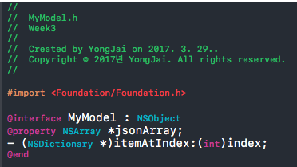

보통 위와 같이 MyModel.h 라는 헤더 파일이 있고 선언부가 저런 식으로 선언이 되어있다라면 MyModel.m 파일에서는 MyModel.h를 import 하게 됩니다. 

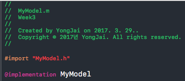

저렇게  `#import "MyModel.h"` 를 하게 되면 헤더 파일에 작성된 모든 코드가 이 한 줄로 대체가 되는 것이고 실제로 컴파일할 때에도 대체가 됩니다. 

만약에 MyModel.h에서 새로운 프로퍼티를 사용하고 싶다면 그 프로퍼티를 가진 헤더 파일을 import 해주면 됩니다.

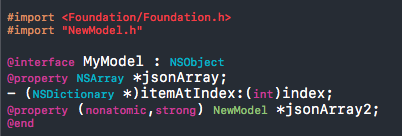

하지만 이렇게 사용을 하는 것은 좋지 않습니다. 왜냐하면 NewModel.h에서도 MyModel.h의 프로퍼티를 가져다가 사용해야 하는 경우가 발생할 수도 있기 때문입니다. 헤더 파일끼리 서로 참조를 하게 되면 컴파일 자체가 되지 않습니다. 

### *//이유는???*

그래서 다음과 같이 사용하는 것이 바람직합니다.

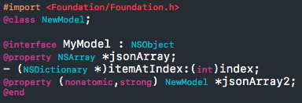

이렇게 `@class NewModel;`을 작성해주고 프로퍼티를 불러오는 것입니다. 이를 `포워드 클래스 선언`이라고 합니다.

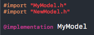

그리고 MyModel.m 파일에 NewModel.h를 import 해주면 됩니다.

**하지만 상위 클래스를 상속하는 경우와 프로토콜을 선언할 때에는 헤더 파일 전체를 import 해줘야 합니다.** 

따라서 헤더 파일을 포함할 때에는 경우에 따라 신중하게 생각해서 해줘야 합니다. 

### item#3. 메서드보다 같은 일하는 리터럴 문법을 사용하라

다음 두 코드를 보고 어떤 게 읽기 쉽고, 편해보이는지 비교 해보겠습니다.

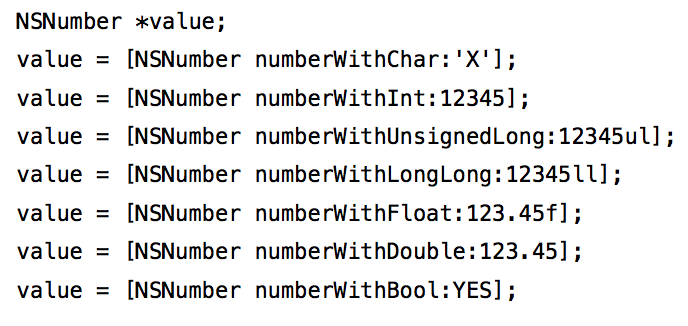 

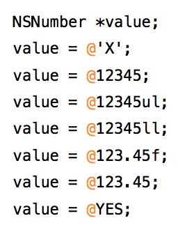 

착한 마음을 가졌다면 당연히 아래 그림이 더 좋다고 말할 것 입니다. 게다가 `@`만 빼면 **Swift**에서 그대로 가져다가 사용할 수 있습니다. 하지만 리터럴 문법은 컴파일 시간이 길어집니다. 예를 들어, 리터럴로 아주 긴 Array를 선언하게 되면 컴파일 시간이 생각한 것 이상으로 길어집니다. 따라서 복잡한 문법의 경우는 리터럴을 사용하는 것보단 파일로 저장해서 불러오는게 좋을 수 있습니다.

**저는 리터럴을 사용하겠습니다!!!! :)**

### item#4. 전처리기 #define보다 타입이 있는 상수를 사용하라

그냥 #define을 사용하지 말라는 소리 입니다. static const를 사용해야 컴파일 에러도 잡힐 뿐더러 어떤 타입인줄 알 수 있기 때문에 사용할 수 있는지 아닌지를 알 수 있습니다. #define을 사용할 경우 타입도 알 수 없고, 에러도 잡히지 않습니다. 

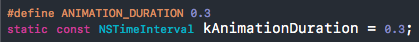

위 코드는 같은 목적을 가지고 선언된 코드지만 static const로 선언된 두 번째 코드를 사용하는게 바람직합니다.

* **static** : file scope 단위의 지역 변수이다.
* **const** : 이 변수의 값을 변경하려고 하면 에러가 발생한다.

이를 전역 변수로 사용할 수도 있는데 그 때 사용하는 것이 `extern`입니다.

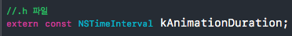 

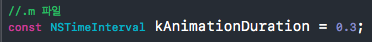 

이렇게 extern을 사용해 선언을 해주면 kAnimationDuration을 전역변수로서 사용할 수 있습니다.

### item#5. 열거형을 사용해 상태, 옵션, 상태 코드를 정의하라

이것도 참 쓰기 불편한 놈인데, 역시나 C의 확장입니다. 

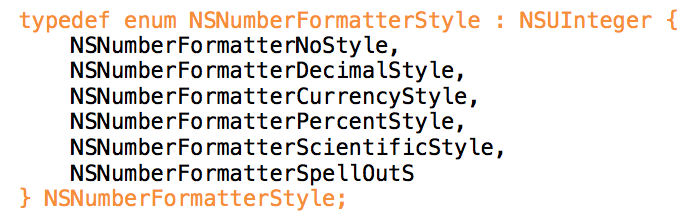 

일반적으로 위와 같이 사용을 하게 되면 타입과 값이 생성됩니다. NSNumberFormatter라는 타입이 고정된 크기(6개)를 가지고 있지만 enum과 새로운 타입에 대한 관계를 컴파일러에서는 알 수 없습니다. 일반적으로 위와 같이 사용하지만 이 책에서는 다음 두 가지의 선택지를 더 제안합니다. 바로 NS_ENUM과 NS_OPTIONS 입니다.

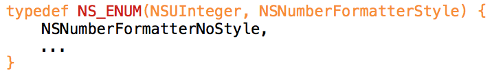 

위 코드가 NS_ENUM을 사용한 코드입니다. NS_ENUM의 첫 번째 파라미터에는 저장할 새로운 자료형의 타입을 입력해주고, 두 번째 파라미터에 새로운 타입의 이름을 입력해줍니다. 블럭 내부에는 평소처럼 값을 지정해주시면 됩니다. 이 방법은 앞서 설명드린 enum방식들의 장점만을 취하고 있습니다. 그리고 컴파일러에게 switch문과 어떤 타입인지를 제공해줍니다.

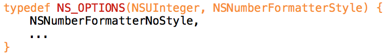 

NS_OPTIONS는 bit mask를 정의할 때 사용합니다. 여러 정보들을 차례대로 1<<0, 1<<1, 1<<2 처럼 만들어서 사용합니다. 각각의 비트는 하나의 boolean값을 나타낼 수 있습니다. 그렇기 때문에 이진수의 특징을 사용하여 or 연산자와 and 연산자를 사용하여 하나의 변수에 여러 가지 정보를 담고 사용할 수 있습니다. 

위 코드에서 NSNumberformmaterStyle은 NSNumberFormatterNoStyle, NSNumberFormatterDecimalStyle, NSNumberFormatterCurrencyStyle, NSNumberFormatterPercentStyle, NSNumberFormatterScientificStyle, NSNumberFormatterSpellOutS값을 포함할 수 있는 bit mask입니다. 

따라서 bitmask를 사용할 때에는 NS_ENUM보다 NS_OPTIONS가 더 적절합니다.

process memory 사진 출처 : https://www.tutorialspoint.com/operating_system/os_processes.htm

