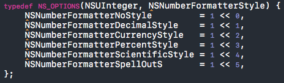

## Effective Objective-C

### Intro
앞으로 7번에 걸쳐 Effective Objective-C라는 책을 보며 공부한 내용과 NHN NEXT iOS_Adv 수업 중에 배운 내용을 함께 정리하고자 합니다. 이 글은 순수하게 공부 목적으로 작성됨을 알려드리면서 시작하겠습니다. 
이 책의 저자는 커뮤니티에 있는 자료들을 모아 자신이 직접 정리해서 어떻게 쓰는 것이 좋다는 측면에서 새롭게 묶어서 작성한 책이라고 합니다. 사실 이 책이 나온지 벌써 4년이 지났는데, Objective-C와 관련된 중급서적이 마땅하지 않아서 이 책을 공부하기로 결정했습니다. 

### item#1. Objective-C의 기원과 친숙해져라

objective-c에는 런타임이라는 것이 숨겨져 있다. 사실 objective-c는 스몰토크라는 언어가 가지고 있는 컨셉과 구조와 문법을 반영해서 만든 언어이다. 그래서 스몰토크에서 넘어온 문법 중에 objective-c에서 가장 많이 사용하는 것이 `대괄호`이다. 특정한 객체에게 메세징을 보낼 때 사용한다. 다음 짧은 코드를 보자.

첫 줄은 obj라는 객체를 만들면서 클래스한테 메세지를 보내게 된다. 

*//여기서 new는 old-fasion한 문법인데 컴파일러가 이 코드를 실행시키면 +alloc 과 -init을 불러준다. 초기에는 스몰토크에서 넘어와서 사용했지만 지금은 사용되지 않는다. 지금도 사용할 수는 있다고 하는데 권장되지는 않는다고 한다.*

두번째 줄은 obj라는 객체에 performWith 함수를 통해 파라미터를 메세징하는 방식이다. 

다음 그림을 보자.

여기서 `isa`라는 게 있다. 처음 보고 아이사, 이사라고 읽었는데 이즈어라고 읽는 거라는걸 알게되고 무지함에 감탄했다. objective-c의 모든 객체는 isa라는 변수를 가지고 있다. isa는 클래스인데 클래스를 가르키는 포인터를 가지고 있다. 

**I'm am a boy**라는 문장을 살펴보자.  I와 boy의 관계를 생각하면 I는 boy의 범주 안에 포함되어 있다. 이를 is a 관계라고 한다. 

[myClassB printVar]를 보면 myClassB와 printVar도 isa 관계입니다. 메세지는 myClassB라는 인스턴스로 전달됩니다. 그러면 런타임이 obj_sendMsg라는 함수 호출을 하게 되고 런타임 함수가 myClassB의 isa 포인터를 보고 myClassB라는 인스턴스가 어떤 클래스인지를 알게 됩니다. 그러면 런타임은 찾은 클래스가 가지고 있는 메소드를 가지고 printVar라는 selector가 어디에 있는 메소드인지 찾아줍니다. 

*//이게 맞는건지 잘 모르겠습니다*ㅜㅜ

Objective-c에서 객체는 `항상` 힙에 할당이 된다.  다음 코드를 통해 좀 더 알아보자.

첫 번째 코드부터 살펴보자. 여기서 인스턴스는 the string이다. 그리고 someString이라는 포인터가 생기는데 이 포인터는 the string을 가르키게 된다. 

두 번째 코드 역시 마찬가지다. anotherString이라는 포인터는 someString의 포인터를 복사하고 the string을 가르키게 된다.

위에서 말했듯이 객체는 힙에 할당이 되어 있고 스택에는 객체를 가르키는 포인터 주소를 담고 있다. 

다음 코드를 보자.

만약 이런 식으로 선언을 하게 되면 어떻게 될까? 에러가 난다. 이유는 간단하다. 무조건 모든 객체는 힙에 만들어져야 하기 때문에 포인터로 선언을 해줘야 한다.

하지만 예외인 경우가 있다. `int`, `double`,`bool`, `CGRect`, `struct` 등등… 이런 것들은 클래스가 아니라 C 타입이고 이러한 타입은 스택에 값을 바로 저장할 수 있기 때문입니다. `NSUInteager` 또한 내부는 int랑 같아서 스택에 바로 값을 저장한다. 이런 것들은 스택 공간 변수라고 불린다. 

#### Bonus!!!  

Objective-C에서는 시점을 다루는 용어가 있고, 뒤에 time을 붙여서 사용한다. 간단히 설명하면 다음과 같다.

* **Design time** : 화면 혹은 코드를 작업할 때
* **Compile time** : 컴파일 해서 빌드가 다 될 때까지
* **Run time** : 빌드가 되고나서 실행 할 때

우리는 Design time에 코드로 인스턴스를 선언하더라도 실제로 인스턴스는 생기지 않고 메모리와 힙이 할당되지 않는다는 것을 알고 있다. 이를 파악하기 위해 process의 memory 구조에 대해 알고 넘어가자.

 

마땅한 자료가 없어 구글에 검색해보니 좋은 그림이 있어서 가지고 왔다. 각 영역별로 간단하게 설명을 하면 다음과 같다.

* **Text** : 컴파일 시점에 만들어진 바이너리 코드가 이 곳에 적재된다.

* **Data** : global 변수가 들어가는데 컴파일 시점에 이미 할당을 해놓는다. 이 영역은 `0으로 채워진 영역`과 `0으로 채워지지 않은 영역` 두 가지로 나누어져 있다. 

  * **0으로 채워진 영역** : 0으로 값이 초기화 되어 있는 변수들
  * **0으로 채워지지 않은 영역** : 초기화 없이 값이 들어있는 변수들

  이렇게 나눠놓은 이유는 읽고 쓰는 영역인지, 그냥 읽기만 하는 영역인지 구분하기 위함이다.

//힙과 스택은 위에서 다뤘으니 넘어가도록 하겠다.

Objective-C 기준으로 프로그램을 시작하면 제일 먼저 main 함수에서 시작하는데 main 함수의 argument 같은 인자값들이 스택에 자리 잡기 시작한다. 이렇게 함수가 실행될 때마다 변수들은 그 크기만큼 선언된 순서대로 스택에 쌓인다. 함수가 호출되는 동안 스택에서는 메모리를 잡고 사용하다가 함수가 return이 되는 순간 할당된 메모리가 사라지고 함수 호출 전의 상태로 돌아간다. 사실 return 할 다음 코드 주소도 스택에 적재되어 있는데 이때 사용되는 것이 `ABI(Application Binary Interface)` 라는 것이다. ABI는 함수 호출 규격과  argument를 어디에 적재시켜 놓을지를 정의하는데 이러한 규격들이 맞아야 프로그램이 실행될 수 있다. ABI 규격은 운영체제마다 다르고 컴파일 된 바이너리 코드는 CPU마다 다르기 때문에 어떤 OS를 사용하고 어떤 CPU를 사용했느냐에 따라 프로그램 실행 여부가 결정된다. 이 때문에 맥에서 컴파일한 코드를 라즈베리 파이에서 실행시킬 수 없는 것이다.  

### item#2. 헤더에 헤더를 포함하는 것을 최소화하라

Objective-C에서 사실 헤더 파일은 꽤나 귀찮은 존재이다. C언어의 잔재라고나 할까… 

헤더 파일에서 interface라고 불리는 영역을 보통 선언부라고 부르는데 이 부분에 프로퍼티나 메소드 같은 무엇인가 적혀있다는 것은 Public하다는 의미가 된다. 즉, 다른 클래스나 파일에서 참조하려면 interface 영역에 선언이 되어 있어야 한다. 반대로 보여지면 안 되는 프로퍼티는 헤더 파일에 선언하면 안된다.

다음 코드를 보면서 헤더 파일에 대해 좀 더 알아보자.

보통 위와 같이 MyModel.h 라는 헤더 파일이 있고 선언부가 저런 식으로 선언이 되어있다라면 MyModel.m 파일에서는 MyModel.h를 import 하게 된다. 

저렇게  `#import "MyModel.h"` 를 하게 되면 헤더 파일에 작성된 모든 코드가 이 한 줄로 대체가 되는 것이고 실제로 컴파일할 때에도 대체가 된다. 

만약에 MyModel.h에서 새로운 프로퍼티를 사용하고 싶다면 그 프로퍼티를 가진 헤더 파일을 import 해주면 된다.

하지만 이렇게 사용을 하는 것은 좋지 않다. 왜냐하면 NewModel.h에서도 MyModel.h의 프로퍼티를 가져다가 사용해야 하는 경우가 발생할 수도 있기 때문이다. 헤더 파일끼리 서로 참조를 하게 되면 컴파일 자체가 되지 않는다. 

### *//이유는???*

그래서 다음과 같이 사용하는 것이 바람직하다.

이렇게 `@class NewModel;`을 작성해주고 프로퍼티를 불러오는 것이다. 이를 `포워드 클래스 선언`이라고 한다.

그리고 MyModel.m 파일에 NewModel.h를 import 해주면 된다.

**하지만 상위 클래스를 상속하는 경우와 프로토콜을 선언할 때에는 헤더 파일 전체를 import 해줘야 한다.** 

따라서 헤더 파일을 포함할 때에는 경우에 따라 신중하게 생각해서 해야한다. 

### item#3. 메서드보다 같은 일하는 리터럴 문법을 사용하라

다음 두 코드를 보고 어떤 게 읽기 쉽고, 편해보이는지 비교 해보자.

 

 

착한 마음을 가졌다면 당연히 아래 그림이 더 좋다고 말할 것이다. 게다가 `@`만 빼면 **Swift**에서 그대로 가져다가 사용할 수 있다. 하지만 리터럴 문법은 컴파일 시간이 길어진다. 예를 들어, 리터럴로 아주 긴 Array를 선언하게 되면 컴파일 시간이 생각한 것 이상으로 길어진다. 따라서 복잡한 문법의 경우는 리터럴을 사용하는 것보단 파일로 저장해서 불러오는게 좋을 수 있다.

**저는 리터럴을 사용하겠습니다!!!! :)**

### item#4. 전처리기 #define보다 타입이 있는 상수를 사용하라

그냥 #define을 사용하지 말라는 소리다. static const를 사용해야 컴파일 에러도 잡힐 뿐더러 어떤 타입인줄 알 수 있기 때문에 사용할 수 있는지 아닌지를 알 수 있다. #define을 사용할 경우 타입도 알 수 없고, 에러도 잡히지 않는다. 

위 코드는 같은 목적을 가지고 선언된 코드지만 아래 코드를 사용하자.

* **static** : file scope 단위의 지역 변수이다.
* **const** : 이 변수의 값을 변경하려고 하면 에러가 발생한다.

이를 전역 변수로 사용할 수도 있는데 그 때 사용하는 것이 `extern`이다.

 

 

이렇게 extern을 사용해 선언을 해주면 kAnimationDuration을 전역변수로서 사용할 수 있다.

### item#5. 열거형을 사용해 상태, 옵션, 상태 코드를 정의하라

이것도 참 쓰기 불편한 놈이다. 역시나 C의 확장이다. 

 

일반적으로 위와 같이 사용한다. 하지만 이 책에서는 다음 두 가지의 선택지를 더 제안한다.

소개하기 앞서서 `매크로`라는 것에 대해 알아보자.

 

 

//미완성

process memory 사진 출처 : https://www.tutorialspoint.com/operating_system/os_processes.htm

