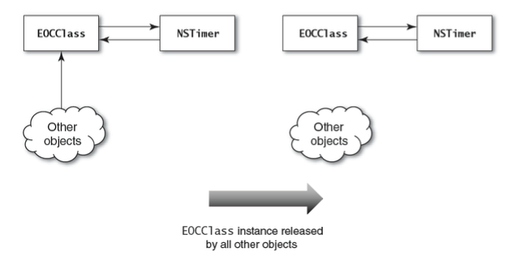

\Effective Objective-C

Item#47. 시스템 프레임워크를 숙지하라

시스템 프레임워크의 종류는 많이 존재합니다. 시스템 프레임워크는 크게 두 가지로 나눠서 생각할 수 있습니다.

- Cocoa Framework = Foundation + AppKit
- Cocoa-Touch Framework = Foundation + UIKit

Foundation은 화면과 상관없이 공통적으로 사용되는 라이브러리를 모아놓았습니다.

AppKit은 Mac용 앱을 만들 때 사용하는 라이브러리들을 모아놓았습니다.

UIKit은 iOS용 앱을 만들 때 사용하는 라이브러리들을 모아놓았습니다.

Foundation이라는 프레임워크 아래에는 Core Foundation이라는 C API 방식의 구조체가 존재합니다. C로 작성된 API는 Objective-C 런타임에 바로 전달하기 때문에 속도가 빠르다는 장점이 있습니다. 그래서 Foundation에서 사용되는 Objective-C 객체와 Core Foundation에서 사용되는 C 구조체 간의 bridge를 해야하는 경우가 있습니다. 이러한 방식을 무비용 전환(Toll-Free Bridge)라고 불르는데 __bridge의 형식으로 사용할 수 있습니다. 예를들어, Foundation의 문자열은 NSString이지만 CoreFoundation에서는 CFString으로 사용되는데 서로 변환을 시키는게 가능하다는 의미입니다. 이 내용은 잠시 후에 다루겠습니다.

Foundation과 CoreFoundation과 함께 많은 라이브러리가 있는데 많이 사용되는 것들에 대해 알아보고자 합니다. 

- Core Audio : 오디오 하드웨어와 인터페이스를 위한 C 수준 API
- Core Video : 비디오 하드웨어와 인터페이스하는 C 수준 API
- AVFoundation : 오디오/비디오를 보여주고, 녹화, 재생하기 위한 Objective-C 객체 제공
- Core Data : 객체 그래프를 Persistence 저장소에 저장하고, 복원, 관리하기 위한Objective-C 객체 제공
- Core Text : 고성능 타이포그래피 텍스트 조판과 렌더링을 위한 C 수준 API
- Core Graphics : 2D 렌더링을 위한 OpenGL ES 추상화한 C 수준 API
- Core Animation : Quartz 프레임워크의 일부로 화면 요소를 렌더링하고 애니메이션하기 위한 Objective-C 객체와 C 수준 API 제공

 Low-Level로 들어가게 되면 C 수준의 API를 자주 사용해야 합니다. 예를 들어, AVFoundation이라는 오디오, 비디오와 관련해서 만들어진 Objective-C로 만들어진 프레임워크다. 그런데 AVFoundation을 통해 만들어진 비디오에서 Frame 단위로 버퍼를 이용해서 픽셀로 받고 싶다고 한다면 Core Video의 CVBuffer, CVImage와 같은 클래스를 가져다가 사용해야 합니다. 즉, AVFoundation을 사용하게되면 결국 Core Audio와 Core Video를 같이 사용할 일이 생기게 됩니다. 

Core Text는 간단히 말하면 E-Book을 만드는 모든 게 들어있다고 생각하면 편합니다. 레이아웃, 이미지, 텍스트, 폰트와 같은 세부적인 것들에 대해 조절할 수 있습니다. 그래서 E-Book Viewer를 만든다고 한다면 Core Text로 랜더링을 해서 HTML처럼 보이게 할 수 있습니다. 

Core Graphics는 2D 그래픽을 그릴 때 사용됩니다. 재밌는 사실은 내부적으로 3D 렌더링을 위한 OpenGL로 구현이 되어 있으며 그 위에 2D를 그리기 위한 엔진이 올라가 있습니다. 그리고 Core Graphics는 Core Animation과 함께 사용할 수 있습니다. (AVFoundation과 Core Audio/Video 처럼)  

Item#48. 반복문에는 블록 열거를 사용하라

한 마디로 말하면 우리가 사용하는 일반적인 for Loop를 사용하지 말라는 의미입니다. 일반적인 for Loop는 다음과 같습니다.

    // for Loop
    
    // Array
    NSArray *anArray = /* ... */
    for (int i = 0; i < anArray.count; i++) {
      id object = anArray[i];
      // ...
    }
    
    // Dictionary
    NSDictionary *aDictionary = /* ... */
    NSArray *keys = [aDictionary allKeys];
    for (int i = 0; i < keys.count; i++) {
      id key = keys[i];
      id value = aDictionary[key]; 
      // ...
    }
    
    // Set
    NSSet *aSet = /* ... */
    NSArray *objects = [aSet allObjects];
    for (int i = 0; i < objects.count; i++) {
      id object = objects[i]; 
      // ...
    }

하지만 위의 방식은 사용하지 말아달라는 것이 저자의 요구입니다. (친숙하긴 하네요ㅎㅎ)

Fast Enumerator 방식도 있습니다.

    // Fast Enumerator
    
    // Array
    NSArray *anArray = /* ... */
    for (id object in anArray) {
    // ... 
    }
    
    // Dictionary
    NSDictionary *aDictionary = /* ... */
    for (id key in aDictionary) {
        id value = aDictionary[key];
    // ...
    }
    
    // Set
    NSSet *aSet = /* ... */
    for (id object in aSet) {
      // ...
    }

Fast Enumerator 방식은 기존의 for Loop보다 훨씬 코드도 간결하고 성능 속도도 가장 빠르다는 장점이 있습니다. 하지만 이 방법을 사용할 때는 인덱스를 별도로 관리해주기 위해 변수를 따로 관리해주어야 합니다. 또한  Dictionary의 Key, Value 값 중에 하나만 받아올 수 있다는 단점이 존재합니다. 그래서 이러한 단점은 블록 기반 열거 방법을 이용하면 깔끔하게 사용할 수 있습니다.

    // Block
    
    // Array
    NSArray *anArray = /* ... */
    [anArray enumerateObjectsUsingBlock:^(id object, NSUInteger idx, BOOL *stop) { 
      // ...
        if (shouldStop) {
          *stop = YES;
        }
    }
     
    // Dictionary
    NSDictionary *aDictionary = /* ... */
    [aDictionary enumerateKeysAndObjectsUsingBlock:^(id key, id object, BOOL *stop) { 
      // ...
       if(shouldStop) {
         *stop = YES; 
       }
    }

블록 기반으로 작성하면 코드가 길어지는게 불편할 수는 있지만 우리에게는 자동완성 기능이 있습니다! 그래서 불편함 없이 사용할 수 있습니다. 배열에서 index와 object를 따로 처리하고, Dictionary에서 key와 value를 따로 받아서 처리할 수 있습니다. 특이한 점은 옵션이 있다는 점입니다. 

- NSEnumerationConcurrent : 병렬로 작업을 실행할 수 있도록 해주는 옵션입니다.
- NSEnumerationReserve : 거꾸로 순회하도록 해주는 옵션입니다.

책의 저자는 블록을 사용해서 열거하는 방식에 익숙해지는 것을 추천하고 있습니다.

Item#49. 커스텀 메모리 관리 시맨틱을 가진 컬랙션을 만들기 위해 무비용 전환을 사용하라

여기에서는 아까 말했던 Toll-Free Bridge에 대해 좀 더 자세히 설명하고 있습니다. Core Foundation은 ARC의 범위가 아니기 때문에 Core Foundation의 구조체를 사용할 때는 수동으로 메모리 관리를 해줘야 합니다. 그러나 Core Foundation 중 일부는 타입 캐스팅을 통해 Objective-C 객체처럼 사용이 가능해서 ARC에게 메모리 관리 책임을 맡길 수 있습니다. 쉽게 설명하면, Foundation의 Objective-C 객체와 Core Foundation의 C 구조체 사이의 형변환(Type Casting)을 어떻게 하는지를 설명하고 있습니다. 타입 캐스팅을 할 때는 컴파일러에게 메모리 관리 책임에 관한 정보를 알려줄 필요가 있는데 3가지를 이용할 수 있습니다.

- __bridge : Objective-C의 객체를 만들어서 Corefoundation 구조체에 bridge를 하는 경우에 사용합니다. 

    id aObcject = [[NSObject alloc] init];
    void *pObject = (__bridge void*) aObject; 
    id otherObject = (__bridge id) pObject;

Objective-C의 객체를 잠시 Core Foundation 타입으로 변환하고 싶을 때 사용합니다. 따라서 ARC가 메모리 해지의 책임을 갖고 있습니다.

- __brige_retain (CFBridgingRetain) : 위와 같은 경우이지만 이때는 retain이라는 말이 더 붙습니다. 그 이유는 객체의 소유권까지 같이 넘겨주기 때문입니다.

    id aObcject = [[NSObject alloc] init];
    void *pObject = (__bridge_retained void*) aObject;

Obj-C 객체를 Core Foundation 구조체로 타입 캐스팅하는 경우 사용합니다.  __bridge와 다른 것은 객체의 소유권까지 넘겨주기 때문에 직접 메모리 해지를 해줘야 합니다. 즉 Core Foundation 타입으로 변환된 객체에 대한 메모리 해지의 책임은 개발자에게 있으며 CFRelease()를 통해 수동으로 관리를 해야 한다.

- __brige_transfer (CFBridgingRelease) : 위의 두 경우와 반대 경우에 사용하게 됩니다. Core Foundation 구조체를 Obj-C 객체로 타입 캐스팅을 할 때 사용되는 지시어 입니다.

    id aObject = (__bridge_transfer id) pObject;

Core Foundation에서 Obj-C 객체로 타입 캐스팅 하는 경우 사용합니다. 보통 생성된 Core Foundation 객체는 CFRelease()를 이용하여 메모리 해지를 해줘야 하지만, Obj-C 객체로 바뀌었으니 ARC에게 메모리 해지 권한을 넘기는 의미입니다.

Item#50. 캐시가 필요할 때 NSDictionary보다는 NSCache를 사용하라

미리 무언가를 가져와서 전에 썼던 것을 계속 사용하는 것이 캐시입니다. 그래서 보통 생각하기를 딕셔너리를 사용해서 키값을 이용해서 value에 저장할 데이터를 넣으면 캐시처럼 사용할 수 있다고 생각하게 됩니다. 물론 사용해도 되긴 하지만 캐시를 사용하기 위한 객체가 존재한다는 것을 알아야 합니다. 바로 NSCache입니다. 사용법은 딕셔너리를 사용하는 방법과 같습니다. 

하지만 NSCache의 장점은 메모리가 부족할 때, 제일 오래되고 사용되지 않는 데이터를 자동으로 비워주게 됩니다. 그리고 딕셔너리는 키 값을 복사하는 데 비해 NSCache를 사용하면 retain을 하기 때문에 참조 할 수 있으며 Thread Safe 합니다.

NSCache에는 리소스 지표라는 것이 있습니다. 캐시에 들어갈 수 있는 객체의 개수를 제한하거나 비용을 제한할 수 있습니다. 여기서 비용은 일정 크기의 객체는 못 들어가게 하거나 일정 기간이 지나면 다 비우게 할 수도 있습니다. 즉, NSCache를 사용하면 캐시에 대한 정책을 정할 수 있기 때문에 편리하게 사용할 수 있습니다. 

Item#51. initialize와 load 메서드는 간결하게 만들라

클래스 메소드 중에서 initialize와 load라는 게 있습니다. 이것들은 클래스 메소드이기 클래스가 메모리에 로드가 될 때, 딱 한 번만 불리게 됩니다. Objective-C를 예로 들면 런타임 시점에 클래스들을 힙에 올리게 되는 데 그 시점에 한 번만 불리게 됩니다. 추가적으로 설명하자면 클래스들도 하나의 객체이기 때문에 힙에 한 자리씩 차지하고 있습니다.

(void)load의 경우를 보겠습니다. load 메소드가 실행되는 순간은 상태가 불안정하고 손상될 수 있기 때문에 이 메소드를 가지고 무엇인가를 하려고 할때, 기대하면 안됩니다. load 메소드가 실행되는 시점이 정확하지 않고, 순서가 보장이 안되기 때문에 이 메소드 안에서 다른 클래스를 실행하면 안됩니다. 가끔 load 메소드가 불렸는지 확인하기 위해 로그를 찍어보는 경우가 있는데 이 조차도 순서가 보장되지 않기 때문에 명확하게 실행되지 않습니다. 또한 이 load 메소드가 불리는 시점은 앱이 실행도 되기 전이고, 클래스가 로딩되고 있는 단계입니다. 그렇다면 무엇을 할 수 있을까? 바로 Swizzling을 사용할 수 있습니다. 클래스가 로딩되는 중이므로 클래스를 바꿔치기해서 클래스를 확장시켜 놓을 수 있는 그런 용도로 사용할 수 있습니다.

(void)initialize의 경우를 보겠습니다. 모든 클래스가 사용하기 직전에 load를 하고 나면 한 번씩 initialize를 하게 됩니다. 음… 설명할게 별로 없네요. 

특이한 경우라서 이 부분에 대해 사용하는 경우가 별로 없을 것입니다. 

요새 사용되는 부분은 RXSwift, RXCocoa라고 불리는게 있는데, RX란 보통 우리는 객체에게 Sync하게 무언가를 시키고 응답을 받는데 RX 방식은 항상 async하게 사용하는 것입니다. 그래서 값이 바꼈는지에 대해 항상 감시를 하고 있어야 합니다. 어떤 이벤트냐에 따라 어떤 동작을 하게 하는지에 대한 방식을 따르는 것입니다. 그 때, 사용되기는 한다고 하는데 아직 감이 오지 않습니다. 아직 Swift도 제대로 안 배웠는데 RXSwift라니… 갈길이 멉니다!!!  

Item#52. NSTimer가 타깃을 리테인한다는 사실을 기억하라

NSTimer는 사용할 곳도 많고 마음대로 쓸 수 있는 유용한 객체입니다. 특정 날짜와 시간 그리고 일정 시간 뒤에 실행되도록 하거나 반복을 정의할 수 있습니다. 타이머를 생성하는 메서드는 다음과 같습니다.

    + (NSTimer*)scheduledTimerWithTimerInterval:(NSTimeInterval)seconds 
    							      target:(id)target
                                       selector:(SEL)selector
                                       userInfo:(id)userInfo

이 메서드를 사용해서 일정 시간 뒤에 이벤트를 발생시키는 타이머를 만들 수 있고, 반복할 수도 있습니다. 중요한 점은 타이머는 타깃을 리테인하기 때문에	반복하는 타이머를 사용할 때는 주의를 해야 합니다. 타이머가 타겟을 만들지만 타이머는 타겟을 리테인 하고 있기 때문입니다. 그래서 반복하는 타이머를 사용하게 되면 상호참조하는 것처럼 서로 물고 있는 형태가 됩니다. 그래서 만약 EOCClass 인스턴스의 참조가 제거되어도 릴리즈되지 않고 살아있게 됩니다. 참조가 제거되었기 때문에 인스턴스에 접근하는 것은 이제 불가능합니다. 영원히 반복이 실행되며 만약 네트워크로부터 데이터를 받아오는 경우라면 영원히 데이터를 받아오게 됩니다. 그림으로 보면 아래와 같습니다.

 

이 문제를 해결하기 위해서는 단 하나의 방법인 블록 기반으로 타이머를 사용해야 합니다. 예시는 다음과 같습니다.

    #import <Foundation/Foundation.h>
    
    @interface NSTimer (EOCBlocksSupport)
    
    + (void)eoc_scheduledTimerWithTimeInterval:(NSTimeInterval)interval
                                     block:(void(^)())block
                                   repeats:(BOOL)repeats;
    
    @end
    
    @implementation NSTimer (EOCBlocksSupport)
    
    + (void)eoc_scheduledTimerWithTimeInterval:(NSTimeInterval)interval
                                     block:(void(^)())block
                                   repeats:(BOOL)repeats
    {
        return [self scheduledTimerWithTimeInterval:interval
                                             target:self
                               selector:@selector(eoc_blockInvoke:)
                                           userInfo:[block copy]
                                            repeats:repeats];
    }
    
    + (void)eoc_blockInvoke:(NSTimer*)timer {
        void (^block)() = timer.userInfo;
        if (block) {
            block();
        }
    }
    
    @end
      
    - (void)startPolling {
        __weak EOCClass *weakSelf = self;
        _pollTimer = 
        [NSTimer eoc_scheduledTimerWithTimeInterval:5.0
                                              block:^{
                                   EOCClass *strongSelf = weakSelf;
                                   [strongSelf p_doPoll];
                                                     }
                                            repeats:YES];  

블록 기반으로 이렇게 만들고, 그 안에서 블록 copy를 해서 사용하면 해결을 할 수 있습니다. 그리고 블록이 self를 잡게 되면 타이머가 블록이 인스턴스를 리테인하기 때문에 weak 참조를 이용해야 합니다. 위에 코드에서 볼 수 있듯이 블록이 일반적인 self가 아니라  weakSelf 변수를 잡고 있도록 하면 self는 리테인 되지 않지만 블록이 실행되면 strong 참조가 됩니다. 즉, 블록이 살아있는 동안 인스턴스의 수명을 보장하게 됩니다. 이렇게 사용하게 되면 약한 참조를 사용했기 때문에 EOCClass의 인스턴스가 가진 마지막 외부 참조가 릴리스 되면 인스턴스는 할당 해제가 될 것입니다.

끝으로

지금까지 Effective Objective-C를 읽고 그 안의 내용들을 정리해봤습니다. 물론 정확하지 않은 내용도 있고 아직 제대로 이해하지 못한 부분도 있기 때문에 계속해서 읽고 공부해야 할 것 같습니다. 

또한 정리도 다 못한채로 마지막 챕터만 이렇게 정리를 했는데 빠른 시일 내로 모두 정리해서 올려야 겠습니다.
