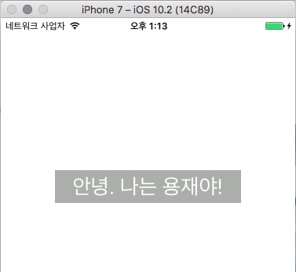

## Localization

이번에 알아볼 내용은 지역화와 관련된 내용입니다. 지역화란 간단하게 제가 앱을 만들어서 배포를 하게 되면 한국어를 지원하게 될 텐데 혹시라도 외국인이 앱을 받아서 사용하게 될 것을 고려해서 외국어도 지원해주는 방법입니다. 생각해보면 어떻게 해야할지 잘 감이 안오고 어렵게 느껴질 수 있습니다. 하지만 Xcode에서 이를 간편하게 설정할 수 있게 잘 지원해주고 있습니다. 

그럼 지금부터 실제 화면을 통해 방법을 알아보겠습니다.

싱글뷰 프로젝트를 하나 만들게 되면 ViewController 하나가 있습니다. 거기에 라벨을 하나 추가하겠습니다. 

 

위와 같이 라벨을 추가하고 그 안에 "Hello. I'm Yongjae"라는 텍스트를 입력했습니다. 

그리고 프로젝트에 들어가보겠습니다. 

 

File Hierarchy에서 가장 위에 프로젝트 이름을 클릭하면 오른쪽과 같은 화면이 나타납니다. `Localizations` 라는 항목이 보이시나요? 보시면 알겠지만 영어가 기본으로 되어 있습니다. + 버튼을 누르면 언어를 추가할 수 있습니다.

 

위와 같이 다양한 언어가 나타나고 저는 한국어를 추가하겠습니다. 한국어를 추가하겠다고 하면 다음과 같은 화면이 나타납니다. 

 

이 화면은 한국어로 지역화를 하고 싶은 파일을 고르라는 화면입니다. 스토리보드랑 런치스크린 두 항목이 나오네요. 그냥 둘 다 선택하고 넘어가겠습니다. 

Finish를 눌렀는데 아무일도 안 일어난 것처럼 느껴지겠지만 사실 바뀐게 있습니다. 

 

위와 같이 스토리보드가 Base와 Korean으로 나뉘었습니다. (물론 Launch Screen도 생겼습니다.) Main.strings(Korean)을 한 번 눌러보면 이상한 텍스트가 있습니다.

 

일단 다음 사진도 보겠습니다. 

 

스토리 보드에 추가시켰던 라벨인데 옆에 Object ID와 위의 괴랄스러운 텍스트를 보면 일치한다는 것을 알 수 있습니다. 

`rXL-ur-WIF.text = "안녕. 나는 용재야!"`라고 바꾸고 실행시켜보겠습니다. 바뀌지 않습니다. 이유는 시뮬레이터의 언어가 영어로 되어있기 때문입니다. 언어를 한국어로 바꾸게 되면 다음과 같은 화면이 나타납니다. 

 

이런 식으로 지역화를 사용하실 수 있습니다.

이 방법 외에 코드를 가지고 생성한 문자열에 대해 지역화를 하는 방법도 있습니다. Strings File이라는 새로운 파일을 만들어 줍니다. 그리고 만들어준 파일에서 지역화하고 싶은 항목을 체크해줍니다. 

 

이렇게 체크를 해주게 되면 다음 화면과 같이 지역별로 두 개의 파일 만들어지게 됩니다.

 

그리고 새로운 라벨을 추가했습니다.

 

그리고 각각의 파일에 다음과 같은 문자를 넣어 줍니다. 설명하자면 왼쪽은 Korean인데 Test를 테스트로 바꾸겠다는 의미입니다. 

 

그리고 NSLocalizedString를 이용해서 다음과 같은 코드를 작성해 줍니다. 

 

NSLocalizedString의 첫번째 인자는 Test라는 값이 해석되면 아까 만든 Localizable.strings에서 지역에 맞는 값을 찾아서 넣어줍니다. 그리고 두 번째 인자는 프로그램에 영향을 주지 않는 코멘트같은 역할로 어떤 값인지 설명을 넣어줘서 가독성을 높여주는 역할을 합니다. 실행을 하면 다음과 같은 화면이 나옵니다.

 

가끔씩 NSLocalizedString을 사용해서 안 되는 경우가 있다. 라벨을 예를 들어 설명하면, 어떤 방식으로 언제 라벨이 생성되었느냐에 따라 적용이 될 때도 있고 안 될때도 있습니다. 그럴 경우, NSLocalizedStringFromTable을 이용하면 해결될 수 있습니다. 아니면 다른 방법으로 라벨의 Object ID를 알아내서 값을 집어 넣으면 되기도 합니다.

### Internalization

Localization이 단순히 언어의 차이를 극복하기 위해 번역하는 것이라면 Internalization은 이보다 더 큰 범주라고 말할 수 있습니다. 지금 그 앱을 사용하고 있는 사람의 지역과 문화를 고려해서 앱을 만들어 줍니다. 간단한 예를들어, 영화를 소개해주는 앱이라고 한다면 한국에서는 한국에서만 개봉된 영화를 소개해주겠지만 일본에서 사용한다면 일본에서 개봉된 영화를 소개해주는 식이라고 생각하면 될 것 같습니다. 

WWDC 동영상 중에 이와 관련된 항목이 많이 있습니다. 

그 중 https://developer.apple.com/videos/play/wwdc2016/201 를 보면 어떻게 사용하는 지에 대해 다루는 것 같습니다. 아직 제대로 보진 않았지만 나라의 문자에 따라 글자 간격이나 라벨의 크기 등을 편리하게 바꿔주는 것과 같이 간단한 번역에서 그치지 않고 앱을 사용하는 그 나라의 사람들에게 맞춰주는 것이 Internalization 입니다. 

 

https://github.com/Yongjai/iOS_Adv/tree/master/Localization_Example 에서 위의 예제를 확인하실 수 있습니다.

