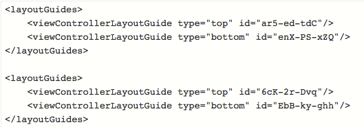

# Storyboard vs NIBs vs Code

### INTRO

이번에 정리할 내용은 iOS 개발을 할 때, UI를 구성하는 방법에 대해 알아보려고 합니다. iOS에서 UI를 개발하는 방법은 3가지가 존재합니다. 사실 저는 Storyboard만 사용해봤기 때문에 다른 방법에 대해서는 잘 모릅니다ㅜㅜ 그래서 다른 방법에 대해 공부하고 UI 개발에 필요한 역량을 좀 더 갖춰가는 계기가 되었으면 하는 바램입니다.

내용은 주로 `https://www.toptal.com/ios/ios-user-interfaces-storyboards-vs-nibs-vs-custom-code` 글의 내용을 번역하여 정리하였습니다. 

*// 모든 내용을 번역하진 않았습니다.*

### 어떤 차가 가장 좋을까?

어떤 사람이 당신에게 묻습니다. "어떤 차를 사는게 좋을까요?" 특정 모델이나 브랜드에 대해 말할거라면 페라리같은 차 외에는 만족할 수 없습니다. 대신에 우리는 다음 질문들을 할 수 있습니다. 

* 예산이 얼마죠?
* 몇 인승이 필요한가요?
* 연비는 어느 정도 생각하시나요?

어떤 특별한 상황이 아니라면 좋은 차와 나쁜 차를 나누는 것은 의미가 없습니다. 요구에 따라 좋은 차가 될 수도 있고 나쁜 차가 될 수도 있습니다.

이제 다시 본래 주제로 돌아오겠습니다. 위에서 예제를 말한 것처럼 **iOS UI 개발을 할 때 가장 좋은 방법이 무엇인가**라는 질문은 같은 맥락입니다. iOS에서 UI를 구성하는 방법은 3가지가 있습니다.

* Storyboard
* NIB(XIB) 
* Code 

위와 같이 3가지 방법이 있는데 3가지의 우열을 가릴 수 있을 정도로 우수한 것은 없습니다. 상황에 따라 다르게 사용하면 되는 것입니다. 

## Storyboard

일반적으로 iOS 개발을 처음할 때 하는 실수는 규모가 좀 있는 프로젝트를 진행할 때 전체 iOS 스토리보드를 만드는 것 입니다. 저 또한 iOS 개발 공부를 시작하면서 생각한게 Storyboard로만 UI를 개발할 수 있다고 생각했었습니다. 다른 방법이 있다는 걸 알게 된 건 시간이 좀 지난 후 였습니다. 어쩔 수 없는게 Storyboard가 default로 지정되어 있기 때문이죠…

#### `일반적으로 초보자의 실수는 하나의 거대한 프로젝트 전반의 스토리 보드를 만드는 것입니다. 스토리보드는 말할 이야기가 있는 보드입니다. 서로 관련이 없는 이야기를 하나의 큰 묶음으로 엮어서는 안됩니다.`

이름처럼 Storyboard는 이야기가 담긴 보드입니다. 관련 없는 이야기를 한 곳에 묶으려고 하면 안 되며 논리적으로 서로 관련이 있어야 합니다. 다음과 같은 예제에서 스토리보드를 사용하는 것이 좋습니다.

* 인증이나 등록을 위한 뷰 세트
* 주문을 위한 단계별 흐름
* 튜토리얼 같은 흐름이 있는 경우

앱이 간단하지 않은 경우를 제외하고는 대형 프로젝트에선 피해야 합니다.

왜 큰 프로젝트에서 스토리보드를 사용하면 안 될까요? 혼자 개발을 하는 거라면 별 문제가 되지 않지만 여러 개발자가 같은 스토리보드 파일을 동시에 사용한다면 **소스 제어 충돌**을 피할 수 없습니다. 또한 스토리보드는 내부적으로 XML 파일로 표시가 됩니다.  그렇기 때문에 각 코드의 의미가 개발자 입장에서 이해하기가 쉽지 않습니다. 

두 명의 개발자가 UILabel의 위치를 변경하고, 후자가 변경 사항을 push하면 다음과 같은 충돌이 생깁니다.

*//id 속성에 주목해서 보시면 됩니다.* 

사실 `id`는 그 자체로 중요한 정보를 담고 있지 않기 때문에 뭐 딱히 할 수 있는 일이 없습니다. 유일하게 할 수 있는 방법은 한 사람을 선택하고 다른 사람의 코드를 버리는 일입니다. 왜냐하면 id는 의미가 없는 정보기 때문입니다. 부작용도 없는 게 자신 말고 아무도 모른다는 겁니다. 

이러한 불편함 때문에 서로 협업이 불가피한 대형 프로젝트에서는 하나의 스토리보드를 사용하면 안되며 여러 스토리보드를 사용해야 합니다.

### 언제 사용해야 할까?

스토리보드는 여러 개의 뷰들이 상호적으로 연결되어 있을 때 사용하는 것이 좋습니다. 뷰 컨트롤러 간에 전환이 간단하기 때문입니다. 이런 측면에서 스토리보드는 뷰 들간의 흐름이 보이는 NIB이라고 말할 수 있습니다. 

흐름을 간단하게 한다는 장점 외에도 pop, push, present, dismiss와 같은 상용 코드를 제거 할 수 있다는 것입니다. 게다가 뷰 컨트롤러는 자동으로 할당이 되기 때문에 수동으로 `alloc`과 `init`을 사용할 필요가 없습니다.

마지막으로 스토리보드는 하나의 이야기에 여러 뷰 컨트롤러가 포함될 때 가장 좋은 선택이지만 TableViewController로 작업할 때는 스토리보드를 사용하는게 좋은 경우가 있습니다. 

* 제자리에 cell prototype을 설계할 때 조각들을 함께 유지하는 데 도움이 됩니다.(?)
* 여러 개의 cell template를 부모 테이블 뷰 컨트롤러 내부에 설계 할 수 있습니다.
* Static한 tableview를 만들 수 있습니다.

첫 번째는 잘 이해는 안되지만 Static Cell 디자인으로 프로토타입이 가능하다는 말 같습니다.

두 번째는 예를 들어 뷰컨트롤러 안에 테이블뷰가 들어 있으면 그 테이블 뷰 안에 cell을 추가해서 작업을 할 수 있다는 것을 의미하는 것 같습니다.

세 번째는 Static Table View는 Storyboard에서만 사용할 수 있는 기능입니다.  

### 사용하기 어려운 경우

* 콘텐츠 구성이나 레이아웃이 복잡하고, 동적으로 바뀌는 경우
* 인터페이스 빌더에서 속성을 바꿀 수 없는 경우
* 버전 관리에서 충돌이 자주 발생하기 때문에 협업을 할 때 사용하기 힘들다.

## NIBs

NIB은 UI 개발을 할 때 사용되는 오래된 방식입니다. 오래된 방식이라는 것이 `deprecated`와 같이 부정적인 의미로 사용되는 것이 아니며, `Storyboard가 NIB의 대체가 아니라는 것`을 명심해야 합니다. NIB는 UI 구현을 단순화 시켜줍니다.

NIB을 사용해서 개발을 하게 되면 임의의 뷰를 만들어 놓고 필요한 ViewController에 연결 시킬 수 있습니다.

NIB을 사용하면 객체 지향을 UI 개발에도 적용시킬 수 있습니다. ViewController의 뷰를 별도의 모듈도 나누어 각각을 NIB 파일로 구현할 수 있습니다. 이 방법이 좋은 이유는 각 구성 요소들에 대해 개발하고 테스트하기 쉬우며 디버깅을 할 때 편리하다는 것입니다.

NIB 파일을 사용한다고 버전 관리를 사용하면서 충돌이 발생하지 않는 건 아니지만 Storyboard에 비해 작은 규모이기 때문에 충돌이 다소 적다는 점이 있습니다.

### 언제 사용해야 할까?

* Model View
* 간단한 로그인과 회원가입 뷰
* 설정하는 뷰
* 팝업 창
* 재사용을 하는 뷰
* 재사용 하는 테이블 셀

### 사용하기 어려운 경우

* 스토리보드와 마찬가지로 콘텐츠 구성이나 레이아웃이 복잡하고 동적으로 바뀌는 경우
* 인터페이스 빌더에서 속성을 바꿀 수 없는 경우
* 스토리보드로 단순화 시킬 수 있는 복잡한 장면 전환이 있는 경우

## CODE

말 그대로 UI를 코드로 작성하는 방법이다. 사실 저는 이런 방법이 있다는 것을 알았을 때, 겁부터 먹었습니다. 어떻게 UI를 코드로 다 짠다는 거지… 하지만 그렇게 겁먹을 필요가 없습니다. 우리가 사용하는 모든 UI는 애초에 코드로 작성되어 있는 것이고 APPLE 홈페이지에서 모든 UI 예제 코드를 보고 공부할 수 있습니다.

https://developer.apple.com/library/content/samplecode/UICatalog/Introduction/Intro.html#//apple_ref/doc/uid/DTS40007710

이 곳에서 모든 UI에 대해 코드로 감상하고 공부 할 수 있습니다.

여담이지만 View를 많이 개발하고 사용하는 회사는 Storyboard와 NIB을 일절 사용하지 않고 코드로만 개발을 한다고 합니다. 실력만 있다면 100% UI를 코드로 만들 수 있기 때문입니다. 

그렇기 때문에 코드를 언제 사용해라 언제 사용해라 할 수 있지 않습니다. 모든 걸 해결해 줄 수 있기 때문이죠. 한 마디로 `마스터키`입니다. 

그리고 위에서 얘기 했듯이 Storyboard와 NIB은 동적인 레이아웃이 있으면 사용할 수 없습니다. 그 경우는 `무조건` 코드로 개발해야 합니다.

### 끝으로

Storyboard, NIB, Code는 UI를 개발하기 위한 각각의 도구입니다. 무엇이 더 좋다라고 말할 수는 없지만 우리가 운이 좋다는 것은 확실합니다. 무려 3가지의 방법이나 존재하기 때문이죠. 키보드에서 손을 떼기 싫어하는 개발자는 두 가지 옵션에 대해 눈길조차 안 줄 것입니다. 하지만 그렇지 않은 개발자들에겐 프로젝트에서 효과적으로 UI를 개발할 수 있는 세 가지의 도구를 Xcode에서 제공해준 것이 됩니다.

*// 저는 키보드에서 손을 떼기 싫은데 아직 실력이 손을 떼게 만드네요.*

