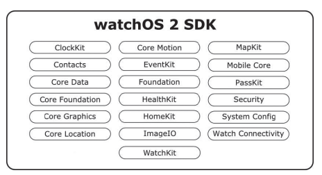

## WatchKit

Apple에서 Apple Watch가 출시되면서 애플 워치에서 개발하기 위해 사용되는 것이 `WatchKit` 입니다.

WatchKit은 온전한 기능을 가진 아이폰 앱을 바탕으로 사용자에게 특정 기능들을 가볍게 제공하기 위한 Extension이라고 할 수 있습니다. WatchOS에서 사용되는 가장 주된 프레임워크가 바로 WatchKit인 것입니다.

애플 워치에서 실행되는 앱을 WatchKit Apps라고 부르며 독립적으로 동작하는 앱이 아니라 기존의 iOS 앱에 대한 Extension으로만 생성될 수 있습니다. 즉, iOS Application의 일부분이 아니라면 WatchKit 앱은 생성될 수 없습니다. 

이 부분만으로는 이해가 되지 않을 수 있습니다. 예를 들어 설명하겠습니다. 만약 오늘의 점심 메뉴를 알려주는 앱이 있다고 가정했을 때, 사용자가 점심 메뉴를 보기 위해서는 아이폰에서 앱을 실행한 뒤에 점심 메뉴를 확인하는 번거로운 과정이 있었다면 애플 워치를 사용하면 쉽게 볼 수 있습니다. 방법은 다음과 같습니다. 점심 메뉴를 알려주는 앱에서 WatchKit Extension을 추가해서 애플 워치 화면에 정보를 보여주도록 UI를 설계하고 원하는 사용자의 인터렉션에 데이터가 응답하도록 로직을 구성하면 됩니다. 따라서 애플 워치에서 WatchKit 앱을 실행해서 간편하게 점심 메뉴를 확인할 수 있습니다.

물론 애플 워치는 애플에서 제공하는 기기 중에서 가장 작은 화면을 가지고 있기 때문에 WatchKit 앱은 일반적인 앱에 표시되는 내용이 모두 표시 되지 않고 필요한 정보들만 보여주게 됩니다. 

애플 워치에서 직접적으로 실행되는 것은 WatchOS라고 불리는 운영체제 입니다. WatchOS에는 WatchOS SDK를 구성하기 위한 프레임워크를 포함하고 있습니다. 그리고 WatchOS SDK에 있는 여러 프레임워크를 통해 WatchKit 앱이 개발됩니다. 계층 구조를 그림으로 나타내면 다음과 같습니다.

개발을 하는 입장에서 가장 중요한 계층은 WatchOS SDK입니다. 개발을 할 때 사용되는 프레임워크를 가지고 있기 때문입니다. 

WatchOS SDK는 위와 같은 요소들로 채워져있습니다.

친숙한 프레임워크들도 존재하지만 WatchKit, Watch Connectivity과 같이 처음 보는 프레임워크도 존재합니다. 또한 iOS에서 사용할 수 있었던 프레임워크의 모든 기능을 사용할 수 있는 것도 아니라는 점을 기억하고 있어야 합니다.

WatchKit 앱은 WatchKit 앱과 WatchKit 익스텐션으로 나뉘어지며, 두 요소는 애플 워치에 설치되고 실행됩니다. 두 요소가 각각 무엇인지 감이 안 올 수 있을 것 같다.

* WatchKit App : UI를 포함하는 스토리보드 파일과 이미지와 같은 리소스로 구성이 되어 있습니다.
* WatchKit Extension : 앱의 기능과 함께 사용자의 인터렉션을 제공하기 위한 코드를 가지고 있습니다. 또한 이미지와 같은 리소스 또한 가질 수 있습니다.

WatchKit 앱에 접근하는 방법은 크게 3가지로 나눌 수 있습니다. 

* 홈 화면을 통한 접근 : 애플 워치의 홈 화면에서 아이콘을 통해 앱에 접근할 수 있습니다.
* Glance를 통한 접근 : WatchKit 앱을 개발할 때, Glance Interface를 추가할 수 있습니다. Glance 기능은 흘낏 본다라는 뜻 그대로 스크롤이 불가능한 읽기만 가능한 단일 화면입니다. 즉, 요약 정보를 표시하는데 많이 사용됩니다. Glance 기능은 애플 워치 화면의 위쪽으로 Swipe를 통해 접근할 수 있습니다.
* Notification : WatchKit 앱에 알림이 오게 되면 그 알림을 터치해서 접근할 수 있습니다.

간단하게 애플 워치의 조작 방식에는 4가지가 존재합니다.

* 터치 이벤트 : 탭 기반으로 조작하는 UI Controller 입니다.
* 제스처 : iOS에서 지원하는 제스처 중에 일부가 사용 가능합니다. 멀티 제스처는 지원을 하지 않습니다.
* 포스 터치 : 애플 워치에서 지원하는 새로운 제스처 입니다. 압력을 인지해서 동작하게 됩니다.
* Digital Crown : 애플 워치에 있는 Digital Crown이라는 작은 회전식 버튼이 있어서 화면을 확대하거나 수치를 조절하고 상하 스크롤, 줌 인, 줌 아웃 등 다양한 기능을 수행할 수 있습니다.

### 참조

핵심만골라배우는애플워치프로그래밍