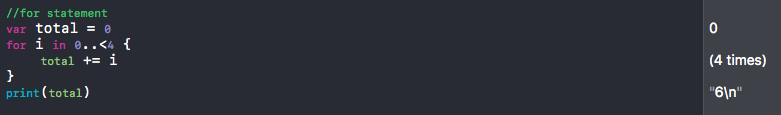

# Swift Tour —1

### Intro

이번에 작성할 주제는 `Swift`의 기본적인 문법에 대한 것입니다. 스위프트를 처음 공부하는 입장이기 때문에 어색하게 설명하거나 틀린 부분이 있을 거라고 생각됩니다. 감안하고 봐주셨으면 좋겠습니다.

여기서 다루는 내용은 Apple Developer의 `A Swift Tour` 문서를 기반으로 작성한 내용이고 두번 에 걸쳐서 정리할 예정입니다.

 

*//Hello, world는 너무 뻔하니까 :)*

## Simple Values

시작은 가볍게 가장 기본적인 것들부터 시작하겠습니다.

#### Variable and Constant

변수는 var를 통해 선언을 합니다. 말 그대로 변수이기 때문에 값을 바꿀 수 있죠. 42에서 50으로 바뀐게 보이시죠?

상수는 let을 통해 선언을 합니다. 상수는 한 번 값을 선언하게 되면 나중에 바꿀 수 없습니다. 

그리고 만약 이 value를 string에 넣고 싶다면 `\(value) `  같은 식으로 넣어주면 됩니다. 

#### Array and Dictionary

배열을 선언 할때는 대괄호를 사용해서 선언해줍니다. 익숙하시죠? 

`shoppingList[1] = "bottle of water"` 를 쓰게 되면 1번 인덱스가 bottle of water로 변경됩니다.

딕셔너리를 선언하는 코드입니다. Objective-C와 다르게 `key:value` 형식으로 값을 지정해주게 됩니다.

 

빈 배열과 딕셔너리를 선언하는 방법입니다. 위 코드는 타입을 지정해놨지만 아래 코드는 타입을 지정해주지 않았습니다. 

**저런식으로 둘 다 선언이 가능하지만 타입을 선언해주는게 컴파일 시에 훨씬 빠르게 동작합니다.**

## Control Flow

다음에 알아볼 것은 제어 흐름입니다.

#### If Statement

그냥 if문은 너무 쉬워서 다른 if문을 넣어 봤습니다. `if-let` 이라는 Swift의 optional 기능 중에 하나입니다. Optional을 다루기엔 너무 긴 주제라 다음 링크를 통해  공부하세요! 그 외에는 우리가 쓰는 일반적인 if문과 똑같습니다.

*//링크가 아직 없는 건 함정ㅎㅎ 바로 올리겠습니다 :)*

#### For Statement

Swift에서는 `for-in`을 사용하는데 코드를 한 번 살펴보겠습니다.

for문에 있는 score는 for문 안에서 사용하기 위해 선언한 변수입니다. 그리고 in 뒤에 있는 individualScore의 아이템 만큼 수행한다는 뜻입니다. 즉, 5개의 아이템이 있으니 for문은 5번 돌게 될 것입니다. 이렇게 for-in 반복문은 range, sequence, collection, progression의 각 아이템 만큼 for문을 돌리게 됩니다.

 

`0..<4` 라는 어색한 코드가 등장했습니다. 0부터 3까지 range를 정해주는 것입니다. 만약 equal을 넣고 싶다면 `0…<4` 라고 점이 3개가 되면 0부터 4까지 range를 정해줍니다.

하지만 이 코드는 1씩 증가하는 오름차순에서만 사용이 가능합니다. 그래서 다른 경우에는 `stride`라는 것을 사용해줘야 합니다.

#### Switch Statement

Switch문도 다를 게 없습니다. 다만 Objective-C와 비교를 하면 Swift는 모든 데이터와 연산에 대해 지원한다는 것입니다. 그리고 코드를 보게되면 `where`라는 게 있습니다. 단순히 값을 비교하는 게 아니라 추가적인 조건을 확인 하는 것입니다. SQL문을 사용해보신 분은 익숙하실 겁니다. X는 Switch문의 비교 대상인 vegetable을 의미하는데 vegetable의 마지막 단어가 "pepper"로 끝나냐를 물어보는 코드가 됩니다.

#### While Statement

 

While문은 소괄호만 없지 똑같지만 `repeat`을 사용하는 방법이 있습니다. 조건을 먼저 비교하냐와 나중에 비교하냐로 나눌 수 있습니다. 즉, repeat은 조건을 나중에 확인하는 방법에서 사용됩니다.  사용할 수 있습니다.

코드를 보면 on day는 두 개의 label로 이루어져 있는 것인데 on은 함수 밖에서, day는 함수 안에서 사용합니다. 코드를 봐도 함수 안에서는 person과 day를 부르지만 밖에서는 없거나 on으로 부르는 것을 알 수 있습니다.

 

함수 안에 함수를 넣어서 사용하는 코드입니다. returnFifteen 함수 안에 add 함수가 들어 있습니다. 

returnFifteen()을 선언하면 returnFifteen 함수가 불리게 되고 y=10이었는데 add()에서 add 함수가 불리게 되면서 y값이 15가 되서 return되는 간단한 코드입니다.

hasAnyMatches(list: numbers, condition: lessThenTen)처럼 함수를 매개변수에 넣어줄 수도 있습니다. 즉, 함수의 매개변수에 함수를 선언하는게 가능합니다. 그리고 함수를 값으로 리턴해주는 것도 가능합니다.

#### Tuple

튜플이라는 것입니다. 코드에서 tuple은 statistics로 선언이 되어 있습니다. 튜플은 return값을 2개 이상 할 수 있게 해줍니다. 코드를 봐도 staticstics.sum과 staticstics.2로 2개의 값을 return 해주는 걸 알 수 있습니다. 좀 더 자세히 설명하면 calculateStatistics라는 함수가 min과 max와 sum을 return 해주는데 각각은 인덱스처럼 사용할 수 있습니다. 

* **statistics.0**과 **statistics.min**과 min값을 return해줍니다.
* **statistics.1**과 **statistics.max**는 max값을 return해줍니다. 
* **statistics.2**과 **statistics.sum**는 sum값을 return해줍니다. 

객체를 따로 만들지 않고도 여러 개의 값을 return해줄 수 있다는게 상당히 좋지만 tuple을 사용하게 되면 Objective-C와 호환을 할 수 없다는 단점이 있습니다.

*//Swift Tour —2에서 계속됩니다.*

