## Swift Tour — 2

저번에 이어서 2번째 Swift Tour에 대해 이야기를 이어나가고자 합니다. 

#### Closure

사실 Closure는 1편에서 다뤘어야 했는데 너무 길어지는 것 같아서…  *// 네 변명입니다ㅎㅎ*

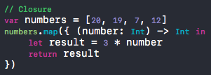  

위 코드는 map함수에 클로저를 넘긴 것입니다. 그렇다면 클로저란 무엇일까? 클로저는 이름없는 함수이므로 함수를 만들지 않고 코드 로직을 만들어서 로직이 클로저로서 반복해서 실행이 됩니다. Objective-C의 Block과 동작 자체는 비슷하지만 다른 개념입니다. 사실 함수는 클로저의 특별한 경우로 나중에 호출 할 수 있는 코드 블럭입니다. 클로저는 클로저가 생성된 범위 내에서 변수와 함수와 같은 것에 접근할 수 있습니다. 심지어 클로저가 다른 범위에서 실행되더라도 가능합니다. **Swift Tour — 2 에서 중첩된 함수** 코드가 바로 그 예제라고 말할 수 있습니다.  클로저는 이름을 쓰지 않고  `{}`로 감싸주면 사용할 수 있습니다. 

그리고 `in`을 사용해서 argument와 return type을 분리할 수 있습니다. 코드를 보게 되면 in 앞에 argument와 return type이 있습니다. 그러면 in 앞이 함수의 타입이라고 볼 수 있습니다. 그리고 in 다음 부분이 함수의 구현부가 됩니다. 

Objective - C의 Block과 Swift의 Closure의 차이점에 대해 간단히 하고 넘어가겠습니다.

Block의 경우 선언을 해주면 block 바깥의 변수를 capture하기 때문에 그 값을 바꿀 수 없습니다. 만약 바꿀라면 밖의 변수에 어떤 block 내부에서 사용한다는 표현을 넣어줘야 바꿀 수 있었습니다. 하지만 Closure의 경우, 바깥의 변수에 대해  참조하고 있습니다. 그래서 만약 Capture를 하려면 명시적으로 in 앞에 capture를 써줘야 합니다. 

코드에 있는 `map`에 대해 궁금해 하실 수 있습니다. 이 method는 Array나 Dictionary같은 Collection에 대해 각 요소에 동일한 작업을 하는데 사용합니다. numbers라는 Array의 각 요소에 3을 곱한 결과가 적용된 Array를 반환 하는 것입니다.

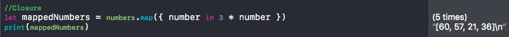

위 코드처럼 map method를 이용해서 mappedNumbers라는 새로운 배열을 만들어줬는데 처음 numbers의 각 요소에 3이 곱해진 결과가 나오는 것을 알 수 있습니다.

#### Class

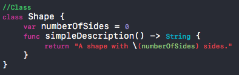 

특별할 것이 없는 클래스 선언입니다. java를 배우셨던 분이라면 new operator를 사용할 필요 없이 그냥 ()로 대체하는 것을 눈치 채실수도 있을 것 같습니다. 뭐 딱히 이해하기 힘든 부분은 없을거라 생각됩니다. 

*// 사실 제가 잘 모릅니다.*

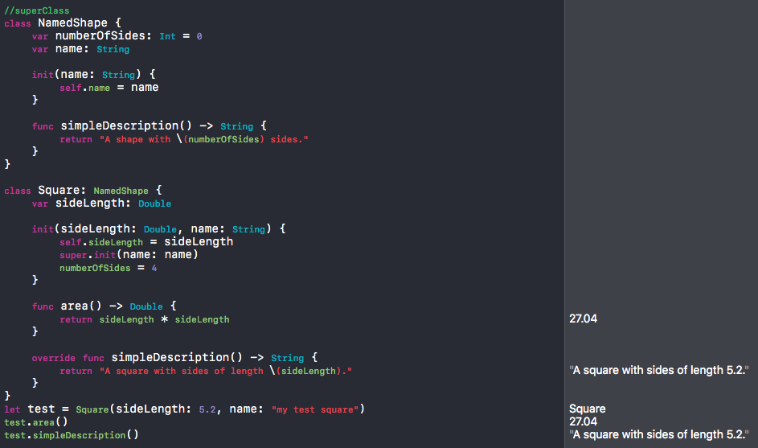

Objective - C와 다르게 Swift는 상속을 받지 않더라도 Class를 만들 수 있습니다. 서브 클래스는 클래스 이름 다음에 수퍼 클래스 이름을 콜론을 이용해 포함하는데 필요에 따라 수퍼 클래스를 포함하거나 생략 할 수 있습니다.  그래서 위에 NamedShape class는 따로 수퍼 클래스를 상속받지 않았습니다. 하지만 Square 클래스는 NamedShape을 상속받았습니다.

살펴볼 것이 있습니다. Squar class에 init이라는 함수가 있는데 안에서 super.init을 부르고 있습니다. 다른 언어들은 보통 상속받으면 상속을 받은 애가 생성자인 경우라면 부모의 생성자를 먼저 부르는게 권장사항이다. 왜냐하면 부모의 생성자들이 먼저 갖춰져야 접근을 할 수 있기 때문입니다. 하지만 Swift의 경우 내 변수들을 먼저 초기화를 하고 나서야 부모 클래스의 생성자를 부를 수 있습니다. 그래서 super.init을 부르기 전에 `self.sideLength =sideLength`라고 자기 변수를 먼저 초기화를 해준 뒤에 부모 클래스의 생성자를 불러주고 있습니다. 

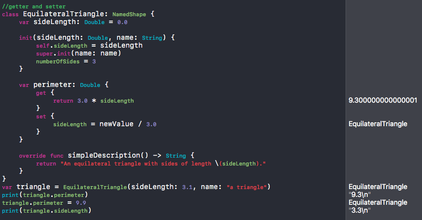

getter와 setter도 위와 같이 사용이 가능합니다. perimeter라는 것에 접근을 하면 get, set 함수가 불리게 되면 저 함수가 계산을 해서 전달을 해준다. 즉, 값을 저장하고 있는게 아니라 sideLength의 값이 바뀔 때마다 계산을 해서 전달해준다. 

#### Enumuration

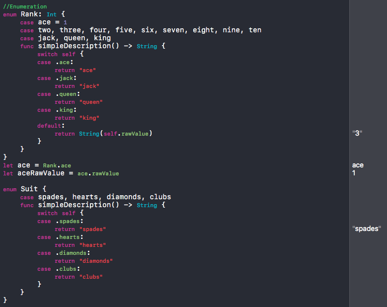 

다음에 알아볼 것은 열거형에 대한 것입니다. 저는 이걸 공부하면서 신기했던게 `ace = 1`로 enum type을 지정해주고 있습니다. 다른 언어도 그런지 모르겠지만 저런식으로 ace를 1로 지정해주면 다음에 오는 열거형에 대해서 자동으로 타입을 넣어준다는 것입니다. two = 2, three =3, …. , jack = 11, queen = 12, king = 13… 순서대로 넣어줍니다. 

rawValue가 뭔지 궁금하실 수 있습니다. enum Rank를 보게되면 Int 타입으로 만들어 놨습니다. Int 타입으로 선언을 해줬기 때문에 ace = 1로 타입을 선언해준 것입니다. 1로 하지 않고 99로 해주더라도 순서에 따라 1씩 증가하게 될 것입니다. 그리고 그런 Int 값들을 rawValue라고 부릅니다. 밑에서 `let aceRawValue = ace.rawValue`라는 코드가 있는데 ace의 번호가 몇 번인지를 묻는 코드입니다. 만약 ace가 아닌 jack이었다면 11이 결과로 나왔을 것입니다.

신기한 것은 다른 언어에서는 Int로만 rawValue를 지정해줄 수 있지만 Swift는 Int가 아닌 어떤 타입이든 가능합니다. 

#### Structure

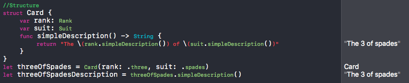

구조체에 대해 알아보겠습니다. 구조체는 상속이 불가능하며 포함관계만 가능하며 Value Type이기 때문에 값이 Stack에 생기게 되서 사용하고 난 뒤에 사라지게 됩니다. 또한 값이 Reference가 아니기 때문에 다른 변수에 넣게 되면 바로 복사가 될 수 있습니다. 사실 구조체는 사용해 본적이 없어서 저도 잘 모르겠습니다ㅜㅜ

#### Protocol

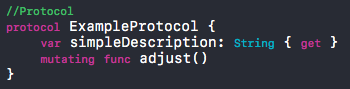 

Objective-C와 다를게 별로 없습니다만 설명을 하자면 method와 property 등의 요구사항을 구현하라고 말해주는 것 입니다. 특정 클래스를 만들면서 프로토콜을 사용하면 프로토콜의 요구대로 method와 property를 직접 구현해 주어야 합니다. 그냥 interface라고 생각하면 됩니다. 사실 말로 이렇게 설명하는 것보다 프로토콜을 한 주제로 해서 자세히 설명하는게 나을 것 같습니다. 

추가적으로 여기서 mutating은 Swift의 예약어 중의 하나로 adjust라는 함수는 내부 변수를 바꾸는 함수라는 것을 명확하게 말해준다. 만약 mutating을 사용하지 않고 내부 변수를 바꾸게 되면 error가 발생한다. 

*//나중에 자세히..*

#### Extension

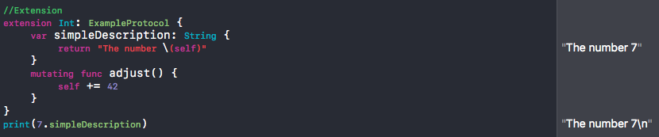

Extension은 기능을 확장하고 추가할 때 사용합니다. 마치 Objective - C의 카테고리와 비슷한 역할을 하는 놈이라고 말할 수 있습니다. 위 코드는 ExampleProtocol에 Int 타입에 대해서도 원하는 protocol을 확장시켜주겠다는 의미로 사용됩니다. 

#### Error Handling

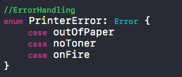 

case에 해당하는 것들에 대해 모두 Error를 날려주는 코드입니다. 간단하니까 넘어가겠습니다.

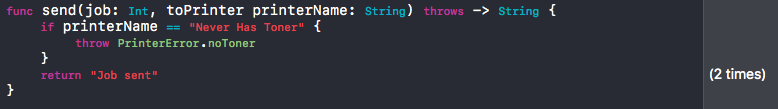 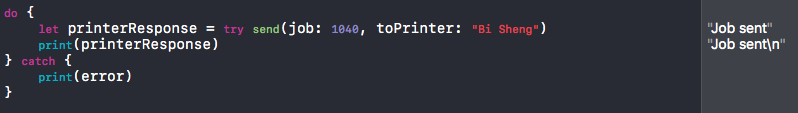 

위 코드처럼 throw를 던지는 함수가 있다면 `do-try-catch문`으로 처리를 해줘야 합니다. do 블록 안에서 send를 불러주면 send에서 argument를 받아서 처리해주게 됩니다. 그때, send에서 error가 발생하게 되면 즉시 함수가 반환되고 do블록으로 넘어가 try문에서 오류를 처리하게 됩니다. 

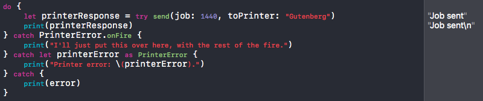  

특정 오류를 처리하는 여러 catch 블록을 만들 수도 있습니다. 스위치 문을 사용하는 경우처럼 캐치 후에 경우를 작성해주면 됩니다. 여기서 as는 type cast로 강제로 캐스트를 해줍니다. printError를 printError로서 캐스팅 하겠다라는 의미입니다.

 

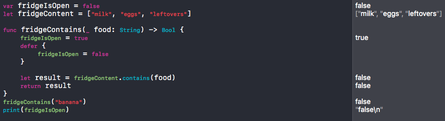 

여기서 봐야할 것은 `defer`입니다. defer를 사용하면 함수가 반환되기 직전에.. 함수의 다른 모든 코드 뒤에 실행되는 코드 블록을 짤 수 있습니다. 즉, 제일 마지막에 불리게 된다고 이해하면 될 것 같습니다.  그렇기 때문에 함수가 throw를 던지는지 여부에 상관없이 코드가 실행됩니다. 

#### Generic

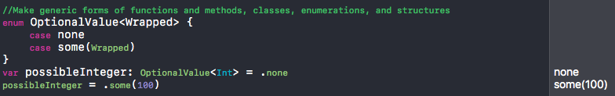 

Generic은 재사용 가능한 함수와 타입이 어떤 타입으로 만들어 질 수 있는 지에 대한 요구사항을 말해줍니다. 중복을 막고 목적을 명확하게 보여주고, 추상적으로 코드를 짤 수 있게 해줍니다.

Objective-C에도 Swift에 generic 기능이 생기면서 같이 추가가 되었습니다. Obj-C에서는 배열을 선언할 때 타입을 지정해주지 않으면 모든 객체를 다 넣을 수 있지만, Generic을 써주면 generic type만 넣을 수 있게 되고 일관성이 있는 사용을 할 수 있습니다.

위 코드는 possibleInteger에 `OptionalValue<Int>`라고 해줘서 Int값만 넣을 수 있게 해놓은 것입니다.

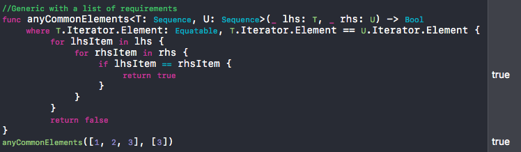 

타입이 프로토콜을 구현하도록 요구하거나, 두 타입이 동일하거나 클래스가 특정 수퍼 클래스를 요구하도록 요구하는 경우가 있습니다.

*// 어려워서 더 공부를 하고 나중에 보완해야 할 것 같습니다.*

#### Outro

지금까지 Swift의 기본적인 것들에 대해서 알아보았습니다. 역시… 어렵습니다. 그래도 공부하면서 이것 저것 또 찾아보게 되고 공부하니까 배우는게 많아서 좋았습니다. 틀린 설명도 많고 이상한 부분도 있겠지만 나름대로 잘 하려고 노력했습니다ㅜㅜ

